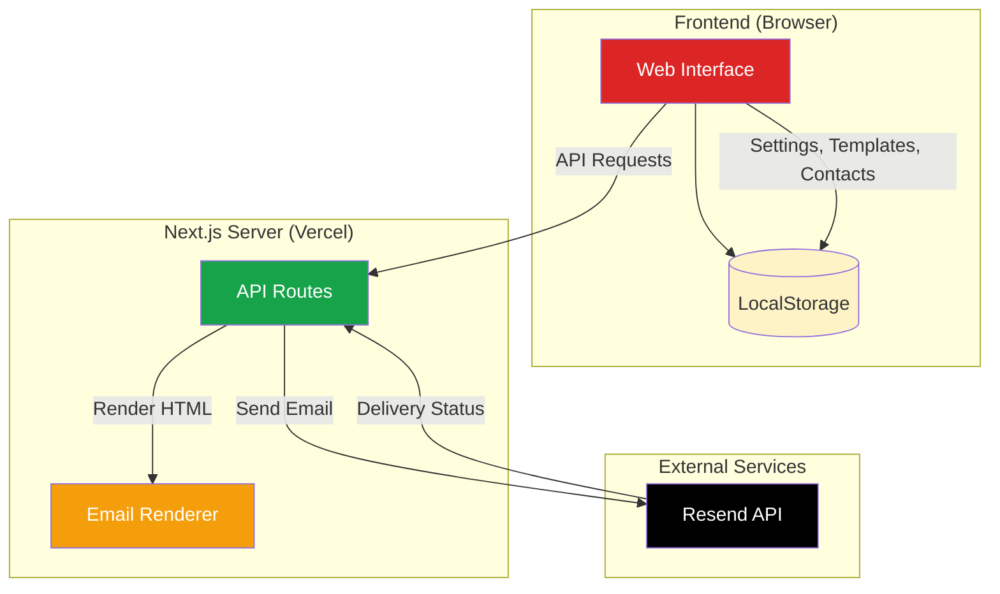
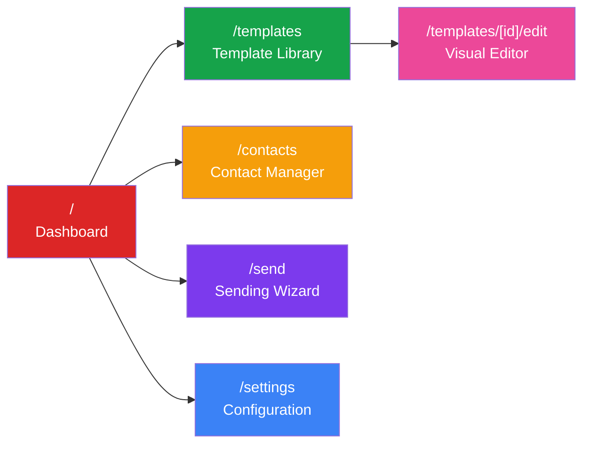
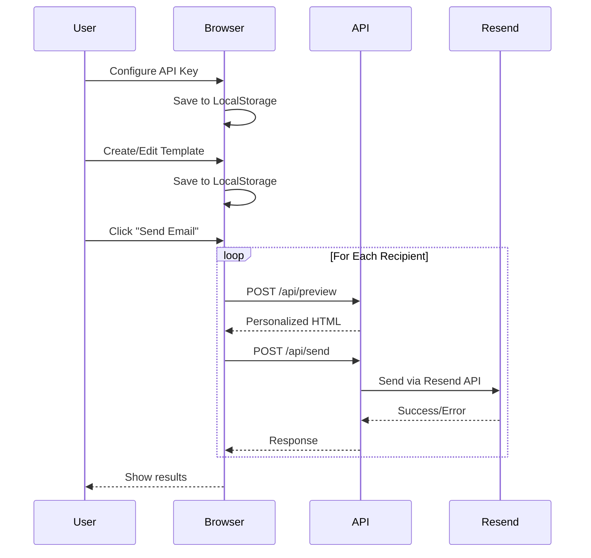

# Email Template Platform

[](https://choosealicense.com/licenses/mit/)
[](https://nextjs.org/)
[](https://react.dev/)
[](https://www.typescriptlang.org/)
[](https://tailwindcss.com/)
[](https://resend.com/)
[](https://christmas-greeting-email.vercel.app/)

A visual email template platform for creating and sending beautiful holiday greetings, marketing emails, and newsletters. Features a bold **Neobrutalism** design style with an intuitive block-based editor.

## Live Demo

**[https://christmas-greeting-email.vercel.app/](https://christmas-greeting-email.vercel.app/)**

No installation required! Use the platform directly in your browser.

---

## Features

### Visual Template Editor
- **Block-based editing** - Add, remove, and reorder content blocks
- **Real-time preview** - See changes instantly in the canvas
- **Device preview** - Toggle between desktop (600px) and mobile (375px) views
- **Theme customization** - Full color palette with color pickers
- **Undo/Redo** - Full history tracking with up to 50 states
- **Auto-save** - Templates persist to browser localStorage

### Email Templates
- **6 Preset Templates** - Ready-to-use professionally designed templates
- **Custom Templates** - Create new templates from scratch
- **Template Copying** - Duplicate any template for customization
- **Category Filtering** - Filter by Holiday, Marketing, or Newsletter

### Contact Management
- **Manual Entry** - Add contacts one by one with form validation
- **CSV Import** - Bulk import contacts from spreadsheet files
- **Resend Sync** - Import contacts from Resend Audiences
- **Edit & Delete** - Full CRUD operations with modal dialogs
- **Search** - Filter contacts by email, first name, or last name

### Email Sending
- **5-Step Wizard** - Guided process from template to send
- **Recipient Selection** - Choose individual or all contacts
- **Personalization** - Dynamic variables like `{{recipientName}}`
- **Real Preview** - See actual rendered email before sending
- **Progress Tracking** - Visual progress bar during batch sending
- **Result Summary** - Per-recipient success/failure reporting

### User-Friendly Design
- **No coding required** - Visual interface for non-technical users
- **Neobrutalism UI** - Bold borders, hard shadows, vibrant colors
- **Responsive layout** - Works on desktop and tablet

---

## System Architecture

### Application Overview



### Page Structure



### Data Flow



---

## Getting Started

### Option 1: Use the Deployed Version (Recommended)

1. Visit **[https://christmas-greeting-email.vercel.app/](https://christmas-greeting-email.vercel.app/)**
2. Go to **Settings** and enter your Resend API Key
3. Add your contacts (manually, CSV, or sync from Resend)
4. Choose a template and customize it
5. Use the Send wizard to send emails!

### Option 2: Run Locally

```bash
# Clone the repository
git clone https://github.com/ChanMeng666/christmas-greeting-email.git
cd christmas-greeting-email

# Install dependencies
npm install

# Start development server
npm run dev

# Open http://localhost:3000
```

### Option 3: Deploy Your Own

[](https://vercel.com/new/clone?repository-url=https://github.com/ChanMeng666/christmas-greeting-email)

---

## User Guide

For detailed usage instructions, see **[TUTORIAL.md](./TUTORIAL.md)**.

Quick overview:

| Step | Action | Description |
|------|--------|-------------|
| 1 | Configure Settings | Enter Resend API Key, sender email, and name |
| 2 | Add Contacts | Add manually, import CSV, or sync from Resend |
| 3 | Choose Template | Select from 6 presets or create your own |
| 4 | Customize | Edit blocks, change colors, add images |
| 5 | Preview | Check desktop/mobile views and real rendering |
| 6 | Send | Use the 5-step wizard with progress tracking |

---

## Tech Stack

### Frontend
| Technology | Version | Purpose |
|------------|---------|---------|
| [Next.js](https://nextjs.org/) | 15.5 | React framework with App Router |
| [React](https://react.dev/) | 19 | UI component library |
| [TypeScript](https://www.typescriptlang.org/) | 5.7 | Type safety |
| [Tailwind CSS](https://tailwindcss.com/) | 3.4 | Utility-first CSS |
| [shadcn/ui](https://ui.shadcn.com/) | - | UI component system |
| [Lucide React](https://lucide.dev/) | 0.468 | Icon library |

### Backend & Services
| Technology | Version | Purpose |
|------------|---------|---------|
| [React Email](https://react.email/) | 0.0.31 | Email template rendering |
| [Resend](https://resend.com/) | 4.0.1 | Email delivery API |
| [Vercel](https://vercel.com/) | - | Hosting & serverless functions |

---

## Project Structure

```
email-template-platform/
├── app/                          # Next.js App Router
│   ├── page.tsx                  # Dashboard homepage
│   ├── layout.tsx                # Root layout with sidebar
│   ├── globals.css               # Global styles + Tailwind
│   ├── templates/
│   │   ├── page.tsx              # Template library with filtering
│   │   └── [id]/edit/page.tsx    # Visual editor with undo/redo
│   ├── contacts/page.tsx         # Contact management with CSV import
│   ├── send/page.tsx             # 5-step sending wizard
│   ├── settings/page.tsx         # Configuration page
│   └── api/
│       ├── send/route.ts         # Email sending endpoint
│       ├── contacts/route.ts     # Resend contacts sync
│       └── preview/route.ts      # Template rendering
├── components/
│   ├── ui/                       # shadcn/ui components
│   └── shared/
│       └── Sidebar.tsx           # Navigation sidebar
├── lib/
│   └── utils.ts                  # Utility functions
├── types/
│   └── template.ts               # TypeScript definitions
└── public/                       # Static assets
```

---

## Template System

### Preset Templates

| Template | Type | Description |
|----------|------|-------------|
| Classic Christmas | Holiday | Red and green Neobrutalism Christmas greeting |
| New Year 2025 | Holiday | Purple and gold celebration theme |
| Chinese New Year | Holiday | Traditional red and gold with Year of the Snake |
| Birthday Wishes | Holiday | Pink and purple colorful celebration |
| Product Launch | Marketing | Gold and blue bold announcement |
| Weekly Newsletter | Newsletter | Green professional digest layout |

### Block Types

| Block | Description | Editable Properties |
|-------|-------------|---------------------|
| **Header** | Title section with subtitle | title, subtitle |
| **Text** | Paragraph content | content (supports variables) |
| **Image** | Photo or graphic | src (URL), alt text |
| **Button** | Call-to-action link | text, url |
| **Wishes List** | Bulleted list with icons | title, items (icon + text) |
| **Divider** | Horizontal separator | (uses theme border settings) |
| **Footer** | Sender signature | senderLabel, senderName |

### Theme Configuration

| Property | Default | Description |
|----------|---------|-------------|
| `primaryColor` | `#DC2626` | Headers, accents (red) |
| `secondaryColor` | `#16A34A` | Buttons, footers (green) |
| `accentColor` | `#F59E0B` | Highlights (gold) |
| `backgroundColor` | `#1a1a2e` | Email body background |
| `surfaceColor` | `#FFFBEB` | Content area background |
| `textColor` | `#000000` | Body text color |
| `borderColor` | `#000000` | Neobrutalism borders |
| `borderWidth` | `4` | Border thickness (px) |
| `shadowOffset` | `8` | Hard shadow offset (px) |

### Personalization Variables

| Variable | Description | Example Output |
|----------|-------------|----------------|
| `{{recipientName}}` | Recipient's first name or email prefix | "John" |
| `{{senderName}}` | Configured sender name | "Jane Smith" |
| `{{currentYear}}` | Current year | "2025" |
| `{{nextYear}}` | Next year | "2026" |

---

## API Endpoints

### POST `/api/send`

Send an email via Resend.

```typescript
// Request body
{
  apiKey: string,      // Resend API key
  from: string,        // Sender email (verified domain)
  to: string,          // Recipient email
  subject: string,     // Email subject
  html: string         // Rendered HTML content
}

// Response
{
  success: boolean,
  data?: { id: string },
  error?: string
}
```

### GET `/api/contacts`

List contacts from Resend Segments.

```typescript
// Query params
?apiKey=re_xxx&audienceId=dc18b68d-cd0a-4c17-baf5-8de8edbf50fa

// Response
{
  success: boolean,
  contacts: Array<{
    email: string,
    first_name?: string,
    last_name?: string
  }>
}
```

### POST `/api/preview`

Render template blocks to HTML.

```typescript
// Request body
{
  blocks: Block[],
  theme: ThemeConfig,
  variables: Record<string, string>
}

// Response
{
  success: boolean,
  html: string
}
```

---

## Security

### Data Storage
- **All data stored locally** - Settings, contacts, templates in browser localStorage
- **No server-side storage** - Nothing persisted on the server
- **API keys sent per-request** - Not stored on server, sent directly to Resend

### Best Practices
- Use environment variables for local development
- Never commit `.env` files to version control
- Create separate Resend API keys for development/production
- Verify your sending domain in Resend for production use

---

## Contributing

Contributions are welcome! Please feel free to submit a Pull Request.

1. Fork the repository
2. Create your feature branch (`git checkout -b feature/AmazingFeature`)
3. Commit your changes (`git commit -m 'Add some AmazingFeature'`)
4. Push to the branch (`git push origin feature/AmazingFeature`)
5. Open a Pull Request

---

## License

This project is licensed under the MIT License - see the [LICENSE](LICENSE) file for details.

---

## Author

**Chan Meng**

- Website: [chanmeng.live](https://chanmeng.live/)
- LinkedIn: [chanmeng666](https://www.linkedin.com/in/chanmeng666/)
- GitHub: [ChanMeng666](https://github.com/ChanMeng666)

---

## Acknowledgments

- [Resend](https://resend.com/) - Email delivery API
- [React Email](https://react.email/) - Email template components
- [shadcn/ui](https://ui.shadcn.com/) - Beautiful UI components
- [Vercel](https://vercel.com/) - Hosting platform
