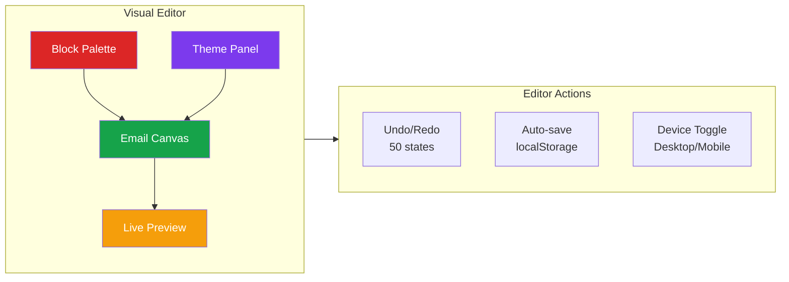
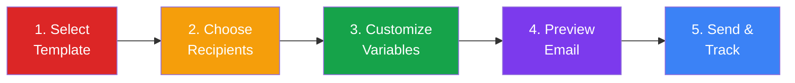
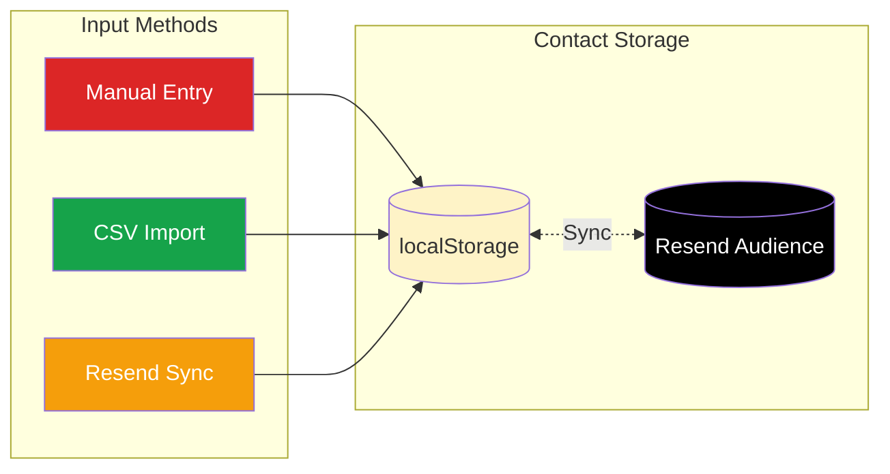
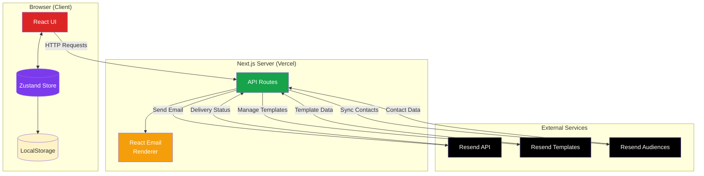
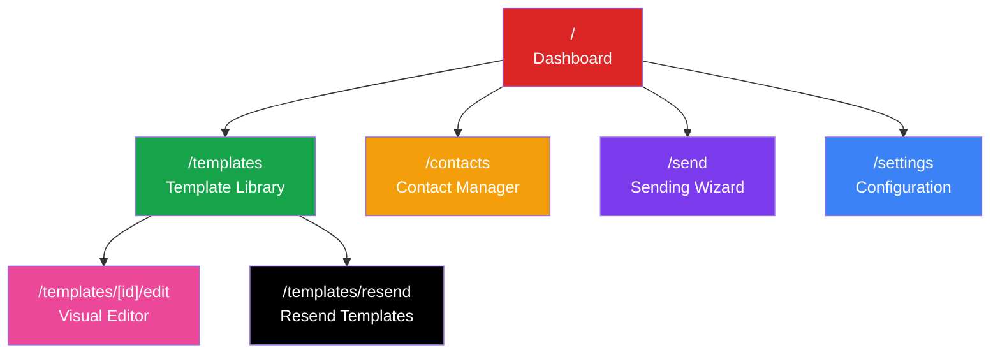
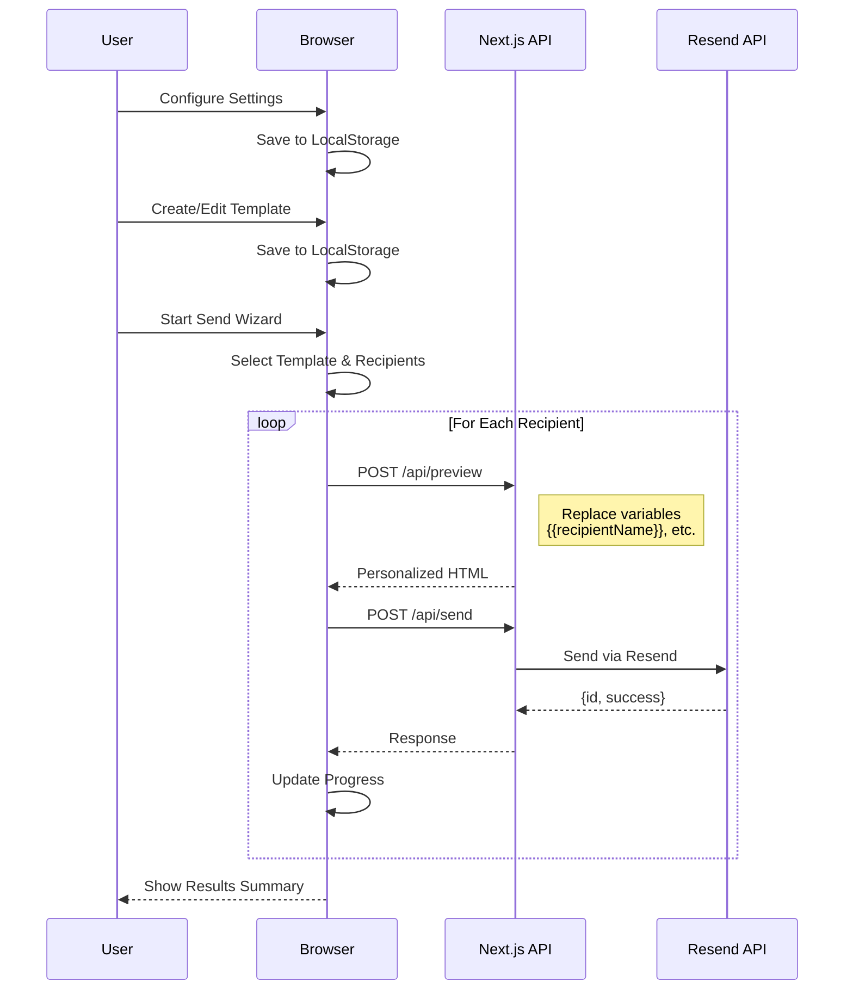
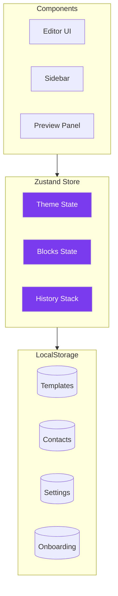
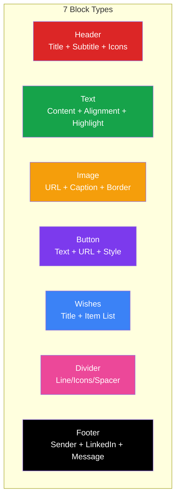
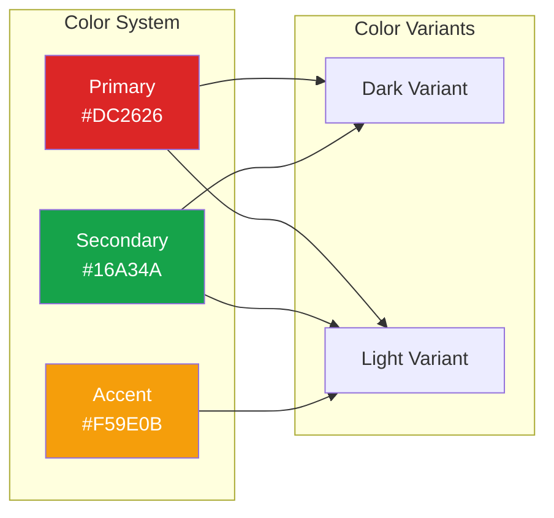
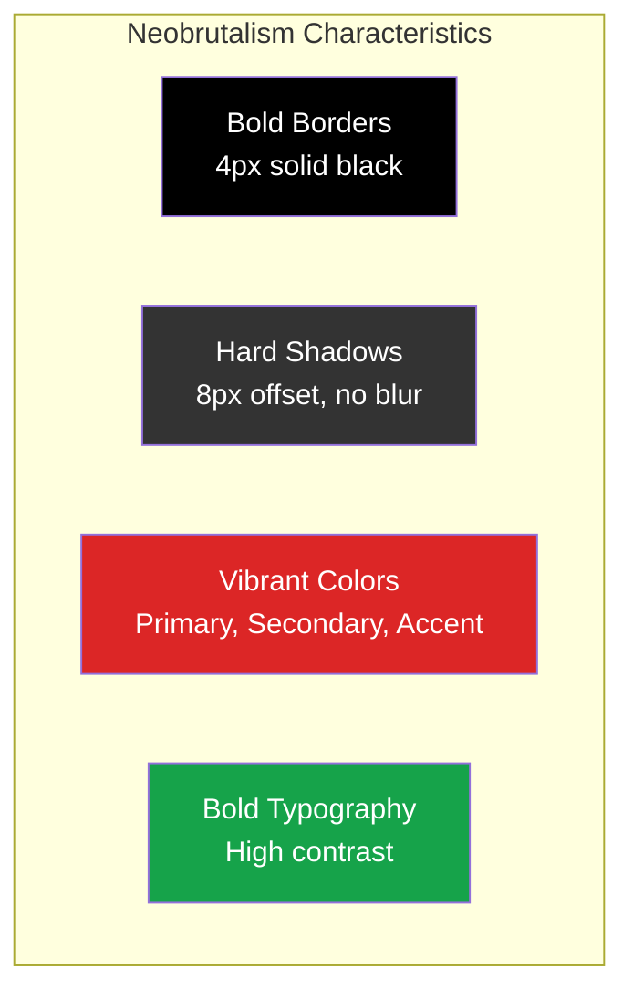

<div align="center"><a name="readme-top"></a>

[](#)

# SendJoy<br/><h3>Visual Email Template Platform</h3>

A beautiful email template platform for creating and sending holiday greetings, marketing emails, and newsletters.<br/>
Features a bold **Neobrutalism** design with an intuitive drag-and-drop block-based editor.<br/>
One-click **FREE** deployment of your personalized email campaigns.

[Live Demo][demo-link] · [Tutorial](./TUTORIAL.md) · [Issues][github-issues-link]

<br/>

[][demo-link]

<br/>

<!-- SHIELD GROUP -->

[![][github-stars-shield]][github-stars-link]
[![][github-forks-shield]][github-forks-link]
[![][github-issues-shield]][github-issues-link]
[![][github-license-shield]][github-license-link]<br/>
[![][vercel-shield]][demo-link]
[![][nextjs-shield]][nextjs-link]
[![][react-shield]][react-link]
[![][typescript-shield]][typescript-link]
[![][tailwind-shield]][tailwind-link]

**Share SendJoy**

[![][share-x-shield]][share-x-link]
[![][share-linkedin-shield]][share-linkedin-link]
[![][share-reddit-shield]][share-reddit-link]
[![][share-whatsapp-shield]][share-whatsapp-link]

<sup>Pioneering the future of email marketing. Built for creators and marketers.</sup>

<br/>

**Tech Stack**


</div>

> [!IMPORTANT]
> SendJoy is a modern email template platform built with Next.js 15, React 19, and TypeScript. It combines a visual drag-and-drop editor with the Resend API for seamless email delivery. Features include 7 block types, real-time preview, theme customization, contact management, and a 5-step sending wizard.

<details>
<summary><kbd>📑 Table of Contents</kbd></summary>

#### TOC

- [SendJoy](#sendjoy)
  - [🌟 Introduction](#-introduction)
  - [✨ Key Features](#-key-features)
    - [`1` Visual Template Editor](#1-visual-template-editor)
    - [`2` Email Sending Wizard](#2-email-sending-wizard)
    - [`3` Contact Management](#3-contact-management)
    - [`*` Additional Features](#-additional-features)
  - [🛠️ Tech Stack](#️-tech-stack)
  - [🏗️ Architecture](#️-architecture)
  - [⚡️ Performance](#️-performance)
  - [🚀 Getting Started](#-getting-started)
  - [🛳 Deployment](#-deployment)
  - [📖 Usage Guide](#-usage-guide)
  - [📦 Template System](#-template-system)
  - [🔌 API Reference](#-api-reference)
  - [🎨 Neobrutalism Design System](#-neobrutalism-design-system)
  - [🔒 Security](#-security)
  - [⌨️ Development](#️-development)
  - [🤝 Contributing](#-contributing)
  - [📄 License](#-license)
  - [🙋‍♀️ Author](#️-author)
  - [🚨 Troubleshooting](#-troubleshooting)
  - [📚 FAQ](#-faq)

####

<br/>

</details>

## 🌟 Introduction

SendJoy is designed for creators, marketers, and businesses who want to send beautiful, personalized emails without coding. Our visual editor makes it easy to create professional email templates with a unique Neobrutalism aesthetic that stands out in any inbox.

Whether you're sending holiday greetings, product announcements, or newsletters, SendJoy provides all the tools you need from template creation to delivery tracking.

> [!NOTE]
> - No coding required - visual drag-and-drop interface
> - Resend API key required for email sending
> - All data stored locally in browser (privacy-first)
> - Works on desktop and tablet browsers

| [![][demo-shield-badge]][demo-link] | No installation required! Visit our live demo to experience SendJoy. |
| :---------------------------------- | :-------------------------------------------------------------------- |

> [!TIP]
> **⭐ Star us** to receive all release notifications from GitHub without delay!

[![][image-star]][github-stars-link]

<details>
  <summary><kbd>⭐ Star History</kbd></summary>
  <picture>
    <source media="(prefers-color-scheme: dark)" srcset="https://api.star-history.com/svg?repos=ChanMeng666%2Fsend-joy&theme=dark&type=Date">
    
  </picture>
</details>

<div align="right">

[![][back-to-top]](#readme-top)

</div>

## ✨ Key Features

### `1` Visual Template Editor

Experience next-generation email design with our intuitive visual editor. Create stunning emails with drag-and-drop simplicity while maintaining full creative control.



Key capabilities include:
- 🎨 **Drag-and-drop editing** - Reorder blocks with intuitive drag-and-drop using @dnd-kit
- 📦 **7 block types** - Header, Text, Image, Button, Wishes List, Divider, Footer
- 👁️ **Real-time preview** - See changes instantly in the canvas
- 📱 **Device preview** - Toggle between desktop (600px) and mobile (375px) views
- 🎨 **Theme customization** - 9+ color options with full color pickers
- ↩️ **Undo/Redo** - Full history tracking with up to 50 states
- 💾 **Auto-save** - Templates persist to browser localStorage

<div align="right">

[![][back-to-top]](#readme-top)

</div>

### `2` Email Sending Wizard

Revolutionary 5-step wizard that guides you from template selection to successful delivery with real-time progress tracking.



**Wizard Features:**
- 📧 **Template Selection** - Choose from presets, custom, or Resend templates
- 👥 **Recipient Selection** - Choose individual or all contacts
- ✨ **Personalization** - Dynamic variables like `{{recipientName}}`
- 👀 **Real Preview** - See actual rendered email before sending
- 📊 **Progress Tracking** - Visual progress bar during batch sending
- ✅ **Result Summary** - Per-recipient success/failure reporting

<div align="right">

[![][back-to-top]](#readme-top)

</div>

### `3` Contact Management

Flexible contact management with multiple import methods and full CRUD operations.



**Management Features:**
- ✍️ **Manual Entry** - Add contacts one by one with form validation
- 📄 **CSV Import** - Bulk import contacts (Email, FirstName, LastName columns)
- 🔄 **Resend Sync** - Import contacts from Resend Audiences
- ✏️ **Edit & Delete** - Full CRUD operations with modal dialogs
- 🔍 **Search** - Filter contacts by email, first name, or last name

<div align="right">

[![][back-to-top]](#readme-top)

</div>

### `*` Additional Features

Beyond the core features, SendJoy includes:

- [x] 💨 **Quick Setup** - Deploy in under 1 minute with one-click installation
- [x] 🎭 **6 Preset Templates** - Ready-to-use professionally designed templates
- [x] 🔒 **Privacy First** - All data stored locally in browser
- [x] 💎 **Neobrutalism UI** - Bold, distinctive design that stands out
- [x] 📱 **Responsive Layout** - Works on desktop and tablet
- [x] 🎯 **Block Visibility** - Show/hide blocks without deleting
- [x] 📋 **Template Copying** - Duplicate any template for customization
- [x] 🏷️ **Category Filtering** - Filter by Holiday, Marketing, Newsletter, or Custom
- [x] 🤝 **Welcome Onboarding** - Guided setup for first-time users
- [x] ❓ **Help System** - Context-aware help modal

> ✨ More features are continuously being added as the project evolves.

<div align="right">

[![][back-to-top]](#readme-top)

</div>

## 🛠️ Tech Stack

<div align="center">
  <table>
    <tr>
      <td align="center" width="96">
        
        <br>Next.js 15
      </td>
      <td align="center" width="96">
        
        <br>React 19
      </td>
      <td align="center" width="96">
        
        <br>TypeScript 5
      </td>
      <td align="center" width="96">
        
        <br>Tailwind 3.4
      </td>
      <td align="center" width="96">
        
        <br>Vercel
      </td>
    </tr>
  </table>
</div>

**Frontend Stack:**

| Technology | Version | Purpose |
|------------|---------|---------|
| [Next.js](https://nextjs.org/) | 15.1.2 | React framework with App Router |
| [React](https://react.dev/) | 19.0.0 | UI component library |
| [TypeScript](https://www.typescriptlang.org/) | 5.7 | Type safety |
| [Tailwind CSS](https://tailwindcss.com/) | 3.4 | Utility-first CSS |
| [shadcn/ui](https://ui.shadcn.com/) | latest | UI component system |
| [Lucide React](https://lucide.dev/) | 0.468 | Icon library |
| [@dnd-kit](https://dndkit.com/) | 6.1+ | Drag-and-drop functionality |
| [Zustand](https://zustand-demo.pmnd.rs/) | 5.0.2 | State management |

**Backend & Services:**

| Technology | Version | Purpose |
|------------|---------|---------|
| [React Email](https://react.email/) | 0.0.31 | Email template rendering |
| [Resend](https://resend.com/) | 4.0.1 | Email delivery API |
| [Vercel](https://vercel.com/) | - | Hosting & serverless functions |

**Additional Libraries:**

| Library | Purpose |
|---------|---------|
| Radix UI | Unstyled UI primitives |
| class-variance-authority | CSS variant management |
| tailwind-merge | Tailwind class merging |
| tailwindcss-animate | Animation plugin |
| clsx | Conditional class names |

> [!TIP]
> Each technology was carefully selected for production readiness, developer experience, and long-term maintainability.

<div align="right">

[![][back-to-top]](#readme-top)

</div>

## 🏗️ Architecture

### System Architecture



### Page Navigation



### Email Sending Flow



### State Management



### Project Structure

```
send-joy/
├── app/                              # Next.js App Router
│   ├── page.tsx                      # Dashboard homepage
│   ├── layout.tsx                    # Root layout with sidebar
│   ├── globals.css                   # Global styles + Tailwind
│   │
│   ├── templates/                    # Template pages
│   │   ├── page.tsx                  # Template library with filtering
│   │   ├── resend/page.tsx           # Resend cloud templates
│   │   └── [id]/edit/page.tsx        # Visual editor with undo/redo
│   │
│   ├── contacts/page.tsx             # Contact management with CSV
│   ├── send/page.tsx                 # 5-step sending wizard
│   ├── settings/page.tsx             # Configuration page
│   │
│   └── api/                          # API Routes
│       ├── send/route.ts             # Email sending endpoint
│       ├── preview/route.ts          # Template rendering
│       ├── contacts/route.ts         # Resend contacts sync
│       └── resend-templates/         # Resend template management
│
├── components/                       # React Components
│   ├── ui/                           # shadcn/ui components
│   ├── shared/                       # Shared components
│   ├── help/                         # Help system
│   ├── onboarding/                   # Onboarding flow
│   ├── progress/                     # Progress tracking
│   └── settings/                     # Settings components
│
├── contexts/                         # React Contexts
├── hooks/                            # Custom Hooks
├── lib/                              # Utilities
├── types/                            # TypeScript Definitions
└── public/                           # Static Assets
```

<div align="right">

[![][back-to-top]](#readme-top)

</div>

## ⚡️ Performance

**Key Metrics:**
- ⚡ **95+ Lighthouse Score** across all categories
- 🚀 **< 1s** Time to First Byte (TTFB)
- 💨 **< 100ms** API response times
- 📊 **99.9%** uptime on Vercel

**Performance Optimizations:**
- 🎯 **LocalStorage Caching** - All data cached locally for instant access
- 📦 **Code Splitting** - Automatic bundle optimization with Next.js
- 🖼️ **Image Optimization** - Next.js Image component with WebP
- 🔄 **Zustand Store** - Efficient state management with minimal re-renders

> [!NOTE]
> Performance metrics are measured using [Lighthouse](https://pagespeed.web.dev/) and continuously monitored in production.

<div align="right">

[![][back-to-top]](#readme-top)

</div>

## 🚀 Getting Started

### Option 1: Use the Deployed Version (Recommended)

| [![][demo-shield-badge]][demo-link] | No installation required! Start using SendJoy immediately. |
| :---------------------------------- | :---------------------------------------------------------- |

1. Visit **[https://send-joy.vercel.app/](https://send-joy.vercel.app/)**
2. Go to **Settings** and enter your Resend API Key
3. Add your contacts (manually, CSV, or sync from Resend)
4. Choose a template and customize it
5. Use the Send wizard to send emails!

### Option 2: Run Locally

> [!IMPORTANT]
> Ensure you have the following installed:
> - Node.js 18.0+ ([Download](https://nodejs.org/))
> - npm/yarn/pnpm package manager
> - Git ([Download](https://git-scm.com/))

**1. Clone Repository**

```bash
git clone https://github.com/ChanMeng666/send-joy.git
cd send-joy
```

**2. Install Dependencies**

```bash
# Using npm
npm install

# Using yarn
yarn install

# Using pnpm (recommended)
pnpm install
```

**3. Start Development Server**

```bash
npm run dev
```

🎉 **Success!** Open [http://localhost:3000](http://localhost:3000) to view the application.

### Option 3: Deploy Your Own

[](https://vercel.com/new/clone?repository-url=https://github.com/ChanMeng666/send-joy)

<div align="right">

[![][back-to-top]](#readme-top)

</div>

## 🛳 Deployment

> [!IMPORTANT]
> Choose the deployment strategy that best fits your needs. Vercel is recommended for the easiest setup.

### Cloud Deployment

**Vercel (Recommended)**

[](https://vercel.com/new/clone?repository-url=https://github.com/ChanMeng666/send-joy)

**Manual Deployment:**

```bash
# Install Vercel CLI
npm i -g vercel

# Deploy
vercel --prod
```

**Other Platforms:**

| Deploy with Netlify | Deploy with Railway |
| :-----------------: | :-----------------: |
| [](https://app.netlify.com/start/deploy?repository=https://github.com/ChanMeng666/send-joy) | [](https://railway.app/new/template?template=https://github.com/ChanMeng666/send-joy) |

### Environment Variables

> [!NOTE]
> SendJoy stores all configuration in browser localStorage. No server-side environment variables are required for basic operation.

For development, you may optionally set:

```bash
# Optional: For server-side Resend operations
RESEND_API_KEY="re_xxxxxxxxxxxxx"
```

<div align="right">

[![][back-to-top]](#readme-top)

</div>

## 📖 Usage Guide

### Basic Usage

**Getting Started:**

1. **Configure Settings** - Add your Resend API Key and sender email
2. **Add Contacts** - Import via CSV, manual entry, or Resend sync
3. **Choose Template** - Select from 6 presets or create custom
4. **Customize** - Edit blocks, colors, and content
5. **Send** - Use the 5-step wizard to deliver emails

### Personalization Variables

| Variable | Description | Example Output |
|----------|-------------|----------------|
| `{{recipientName}}` | Recipient's first name or email prefix | "John" |
| `{{senderName}}` | Configured sender name | "Jane Smith" |
| `{{currentYear}}` | Current year | "2025" |
| `{{nextYear}}` | Next year | "2026" |

**Syntax Support:**
- Local preview syntax: `{{variableName}}` (camelCase)
- Resend template syntax: `{{{VARIABLE_NAME}}}` (UPPER_SNAKE_CASE)

### Data Storage

All data is stored in browser localStorage (no server-side storage):

| Key | Content |
|-----|---------|
| `email-platform-templates` | Custom templates |
| `email-platform-contacts` | Local contacts |
| `email-platform-settings` | API key, sender info |
| `email-platform-onboarding` | First-visit and progress state |
| `email-platform-emails-sent` | Send count |
| `email-platform-sidebar-collapsed` | Sidebar collapse state |

<div align="right">

[![][back-to-top]](#readme-top)

</div>

## 📦 Template System

### Preset Templates

| Template | Category | Description |
|----------|----------|-------------|
| Classic Christmas | Holiday | Red and green Neobrutalism Christmas greeting |
| New Year 2025 | Holiday | Purple and gold celebration theme |
| Chinese New Year | Holiday | Traditional red and gold with Year of the Snake |
| Birthday Wishes | Holiday | Pink and purple colorful celebration |
| Product Launch | Marketing | Gold and blue bold announcement |
| Weekly Newsletter | Newsletter | Green professional digest layout |

### Block Types



| Block | Description | Editable Properties |
|-------|-------------|---------------------|
| **Header** | Title section | title, subtitle, showIcons, icons |
| **Text** | Paragraph content | content, alignment, highlightBox |
| **Image** | Photo or graphic | src, alt, caption, borderStyle, shadowColor |
| **Button** | Call-to-action link | text, url, style (primary/secondary/outline) |
| **Wishes List** | Bulleted list with icons | title, items (icon + text array) |
| **Divider** | Horizontal separator | style (line/icons/spacer), height |
| **Footer** | Sender signature | senderName, senderLabel, showLinkedIn, linkedInUrl, closingMessage |

### Theme Configuration



| Property | Default | Description |
|----------|---------|-------------|
| `primaryColor` | `#DC2626` | Headers, accents (red) |
| `primaryColorDark` | `#B91C1C` | Dark variant |
| `primaryColorLight` | `#FEE2E2` | Light variant |
| `secondaryColor` | `#16A34A` | Buttons, footers (green) |
| `secondaryColorDark` | `#15803D` | Dark variant |
| `secondaryColorLight` | `#DCFCE7` | Light variant |
| `accentColor` | `#F59E0B` | Highlights (gold) |
| `accentColorLight` | `#FEF3C7` | Light variant |
| `backgroundColor` | `#1a1a2e` | Email body background |
| `surfaceColor` | `#FFFBEB` | Content area background |
| `textColor` | `#000000` | Body text color |
| `borderColor` | `#000000` | Neobrutalism borders |
| `borderWidth` | `4` | Border thickness (px) |
| `shadowOffset` | `8` | Hard shadow offset (px) |
| `fontFamily` | `Georgia, serif` | Font family |

<div align="right">

[![][back-to-top]](#readme-top)

</div>

## 🔌 API Reference

### POST `/api/send`

Send an email via Resend.

```typescript
// Request body
{
  apiKey: string,      // Resend API key
  from: string,        // Sender email (verified domain)
  to: string | string[], // Recipient email(s)
  subject: string,     // Email subject
  html: string         // Rendered HTML content
}

// Response
{
  success: boolean,
  data?: { id: string },
  error?: string
}
```

### POST `/api/preview`

Render template blocks to HTML.

```typescript
// Request body
{
  blocks: EmailBlock[],         // Content blocks
  theme: ThemeConfig,           // Theme configuration
  variables: Record<string, string>  // Personalization variables
}

// Response
{
  success: boolean,
  html: string
}
```

### GET `/api/contacts`

List contacts from Resend Audiences.

```typescript
// Query params
?apiKey=re_xxx&audienceId=dc18b68d-xxx

// Response
{
  success: boolean,
  contacts: Array<{
    email: string,
    first_name?: string,
    last_name?: string
  }>
}
```

### POST/DELETE `/api/contacts`

Add or remove contacts from Resend Audience.

```typescript
// POST Request body (add contact)
{
  apiKey: string,
  audienceId: string,
  email: string,
  firstName?: string,
  lastName?: string
}

// DELETE Request body (remove contact)
{
  apiKey: string,
  audienceId: string,
  email: string
}
```

### GET `/api/resend-templates`

List all Resend cloud templates.

```typescript
// Query params
?apiKey=re_xxx

// Response
{
  success: boolean,
  templates: Array<{
    id: string,
    name: string,
    created_at: string
  }>
}
```

### POST `/api/resend-templates/[id]/duplicate`

Duplicate a Resend template.

### POST `/api/resend-templates/[id]/publish`

Publish a Resend template.

<div align="right">

[![][back-to-top]](#readme-top)

</div>

## 🎨 Neobrutalism Design System

### Design Principles



### Custom Tailwind Colors

```css
neo-red: #DC2626
neo-red-dark: #B91C1C
neo-green: #16A34A
neo-green-dark: #15803D
neo-gold: #F59E0B
neo-cream: #FEF3C7
neo-warm: #FFFBEB
```

### Shadow Utilities

```css
shadow-neo-sm: 2px 2px 0px black
shadow-neo: 4px 4px 0px black
shadow-neo-lg: 8px 8px 0px black
shadow-neo-red: 4px 4px 0px #DC2626
shadow-neo-green: 4px 4px 0px #16A34A
shadow-neo-gold: 4px 4px 0px #F59E0B
```

<div align="right">

[![][back-to-top]](#readme-top)

</div>

## 🔒 Security

### Data Storage
- **All data stored locally** - Settings, contacts, templates in browser localStorage
- **No server-side storage** - Nothing persisted on the server
- **API keys sent per-request** - Not stored on server, sent directly to Resend

### Best Practices

> [!WARNING]
> Never share your Resend API key publicly or commit it to version control.

- 🔐 Use different Resend API keys for development/production
- ✅ Verify your sending domain in Resend for production use
- 🚫 Never commit `.env` files to version control
- 🔄 Delete and recreate API keys if you suspect compromise

<div align="right">

[![][back-to-top]](#readme-top)

</div>

## ⌨️ Development

### Local Development

```bash
# Clone repository
git clone https://github.com/ChanMeng666/send-joy.git
cd send-joy

# Install dependencies
npm install

# Start development server
npm run dev

# Build for production
npm run build

# Start production server
npm start
```

### Development Scripts

```bash
# Development
npm run dev          # Start dev server on port 3000

# Production
npm run build        # Build for production
npm start            # Start production server

# Code Quality
npm run lint         # ESLint check
npm run type-check   # TypeScript check (if configured)
```

<div align="right">

[![][back-to-top]](#readme-top)

</div>

## 🤝 Contributing

We welcome contributions! Here's how you can help improve SendJoy:

### Development Process

**1. Fork & Clone:**

```bash
git clone https://github.com/ChanMeng666/send-joy.git
cd send-joy
```

**2. Create Branch:**

```bash
git checkout -b feature/your-feature-name
```

**3. Make Changes:**

- Follow TypeScript best practices
- Maintain Neobrutalism design consistency
- Test on both desktop and mobile views
- Update documentation as needed

**4. Submit PR:**

- Provide clear description
- Include screenshots for UI changes
- Reference related issues

[![][pr-welcome-shield]][pr-welcome-link]

<a href="https://github.com/ChanMeng666/send-joy/graphs/contributors" target="_blank">
  <table>
    <tr>
      <th colspan="2">
        <br><br><br>
      </th>
    </tr>
  </table>
</a>

<div align="right">

[![][back-to-top]](#readme-top)

</div>

## 📄 License

This project is licensed under the MIT License - see the [LICENSE](LICENSE) file for details.

**Open Source Benefits:**
- ✅ Commercial use allowed
- ✅ Modification allowed
- ✅ Distribution allowed
- ✅ Private use allowed

<div align="right">

[![][back-to-top]](#readme-top)

</div>

## 🙋‍♀️ Author

<div align="center">
  <table>
    <tr>
      <td align="center">
        <a href="https://github.com/ChanMeng666">
          
          <br />
          <sub><b>Chan Meng</b></sub>
        </a>
        <br />
        <small>Creator & Lead Developer</small>
      </td>
    </tr>
  </table>
</div>

**Chan Meng**
-  LinkedIn: [chanmeng666](https://www.linkedin.com/in/chanmeng666/)
-  GitHub: [ChanMeng666](https://github.com/ChanMeng666)
-  Website: [chanmeng.live](https://chanmeng.live/)

<div align="right">

[![][back-to-top]](#readme-top)

</div>

## 🚨 Troubleshooting

<details>
<summary><kbd>🔧 Common Issues</kbd></summary>

### Installation Issues

**Node.js Version Conflicts:**
```bash
# Check Node.js version
node --version

# Use Node Version Manager
nvm install 18
nvm use 18
```

**Package Installation Failures:**
```bash
# Clear npm cache
npm cache clean --force

# Delete node_modules and reinstall
rm -rf node_modules package-lock.json
npm install
```

### Development Issues

**Port Already in Use:**
```bash
# Find process using port 3000 (Linux/Mac)
lsof -i :3000

# Find process using port 3000 (Windows)
netstat -ano | findstr :3000

# Kill the process
kill -9 <PID>  # Linux/Mac
taskkill /PID <PID> /F  # Windows
```

### Email Sending Issues

**Emails Not Sending:**
- Verify your Resend API key is correct
- Check that your sender email domain is verified in Resend
- Ensure recipient email addresses are valid

**Template Not Rendering:**
- Check browser console for JavaScript errors
- Verify all required block properties are set
- Clear localStorage and try again

</details>

<div align="right">

[![][back-to-top]](#readme-top)

</div>

## 📚 FAQ

<details>
<summary><kbd>❓ Frequently Asked Questions</kbd></summary>

**Q: Can I use SendJoy commercially?**
A: Yes, this project is licensed under MIT license, allowing commercial use.

**Q: Do I need a Resend account?**
A: Yes, you need a free Resend account to send emails. Sign up at [resend.com](https://resend.com/).

**Q: Where is my data stored?**
A: All data (templates, contacts, settings) is stored in your browser's localStorage. Nothing is stored on our servers.

**Q: Can I use custom fonts?**
A: Email clients have limited font support. We recommend using web-safe fonts like Georgia, Arial, or system fonts.

**Q: How many emails can I send?**
A: This depends on your Resend plan. The free tier allows 100 emails/day.

**Q: Is there mobile app support?**
A: SendJoy is a web application with responsive design. It works well on tablets but is optimized for desktop use.

</details>

---

<div align="center">

**Made with ❤️ by Chan Meng**

<br/>

⭐ **Star us on GitHub** • 📖 **Read the Tutorial** • 🐛 **Report Issues** • 💡 **Request Features**

<br/>

[![][github-stars-shield]][github-stars-link]
[![][github-forks-shield]][github-forks-link]

</div>

---

## 🙏 Acknowledgments

- [Resend](https://resend.com/) - Email delivery API
- [React Email](https://react.email/) - Email template components
- [shadcn/ui](https://ui.shadcn.com/) - Beautiful UI components
- [@dnd-kit](https://dndkit.com/) - Drag and drop toolkit
- [Zustand](https://zustand-demo.pmnd.rs/) - State management
- [Vercel](https://vercel.com/) - Hosting platform

---

<!-- LINK DEFINITIONS -->

[back-to-top]: https://img.shields.io/badge/-BACK_TO_TOP-151515?style=flat-square

<!-- Project Links -->
[demo-link]: https://send-joy.vercel.app/
[github-issues-link]: https://github.com/ChanMeng666/send-joy/issues
[github-stars-link]: https://github.com/ChanMeng666/send-joy/stargazers
[github-forks-link]: https://github.com/ChanMeng666/send-joy/forks
[github-license-link]: https://github.com/ChanMeng666/send-joy/blob/main/LICENSE
[pr-welcome-link]: https://github.com/ChanMeng666/send-joy/pulls

<!-- Tech Links -->
[nextjs-link]: https://nextjs.org/
[react-link]: https://react.dev/
[typescript-link]: https://www.typescriptlang.org/
[tailwind-link]: https://tailwindcss.com/

<!-- Shield Badges -->
[github-stars-shield]: https://img.shields.io/github/stars/ChanMeng666/send-joy?color=ffcb47&labelColor=black&style=flat-square
[github-forks-shield]: https://img.shields.io/github/forks/ChanMeng666/send-joy?color=8ae8ff&labelColor=black&style=flat-square
[github-issues-shield]: https://img.shields.io/github/issues/ChanMeng666/send-joy?color=ff80eb&labelColor=black&style=flat-square
[github-license-shield]: https://img.shields.io/badge/license-MIT-white?labelColor=black&style=flat-square
[vercel-shield]: https://img.shields.io/badge/vercel-deployed-55b467?labelColor=black&logo=vercel&style=flat-square
[nextjs-shield]: https://img.shields.io/badge/Next.js-15-000000?labelColor=black&logo=next.js&logoColor=white&style=flat-square
[react-shield]: https://img.shields.io/badge/React-19-61DAFB?labelColor=black&logo=react&logoColor=white&style=flat-square
[typescript-shield]: https://img.shields.io/badge/TypeScript-5.7-3178C6?labelColor=black&logo=typescript&logoColor=white&style=flat-square
[tailwind-shield]: https://img.shields.io/badge/Tailwind-3.4-06B6D4?labelColor=black&logo=tailwindcss&logoColor=white&style=flat-square
[pr-welcome-shield]: https://img.shields.io/badge/PRs_welcome-%E2%86%92-ffcb47?labelColor=black&style=for-the-badge

<!-- Badge Variants -->
[demo-shield-badge]: https://img.shields.io/badge/TRY_DEMO-LIVE-55b467?labelColor=black&logo=vercel&style=for-the-badge

<!-- Social Share Links -->
[share-x-link]: https://x.com/intent/tweet?hashtags=email,marketing,opensource&text=Check%20out%20SendJoy%20-%20A%20beautiful%20email%20template%20platform&url=https%3A%2F%2Fgithub.com%2FChanMeng666%2Fsend-joy
[share-linkedin-link]: https://linkedin.com/sharing/share-offsite/?url=https://github.com/ChanMeng666/send-joy
[share-reddit-link]: https://www.reddit.com/submit?title=SendJoy%20-%20Visual%20Email%20Template%20Platform&url=https%3A%2F%2Fgithub.com%2FChanMeng666%2Fsend-joy
[share-whatsapp-link]: https://api.whatsapp.com/send?text=Check%20out%20SendJoy%20-%20A%20beautiful%20email%20template%20platform%20https%3A%2F%2Fgithub.com%2FChanMeng666%2Fsend-joy

[share-x-shield]: https://img.shields.io/badge/-share%20on%20x-black?labelColor=black&logo=x&logoColor=white&style=flat-square
[share-linkedin-shield]: https://img.shields.io/badge/-share%20on%20linkedin-black?labelColor=black&logo=linkedin&logoColor=white&style=flat-square
[share-reddit-shield]: https://img.shields.io/badge/-share%20on%20reddit-black?labelColor=black&logo=reddit&logoColor=white&style=flat-square
[share-whatsapp-shield]: https://img.shields.io/badge/-share%20on%20whatsapp-black?labelColor=black&logo=whatsapp&logoColor=white&style=flat-square

<!-- Images -->
[image-star]: https://img.shields.io/badge/⭐_Star_Us_on_GitHub-FFD700?style=for-the-badge&labelColor=black
