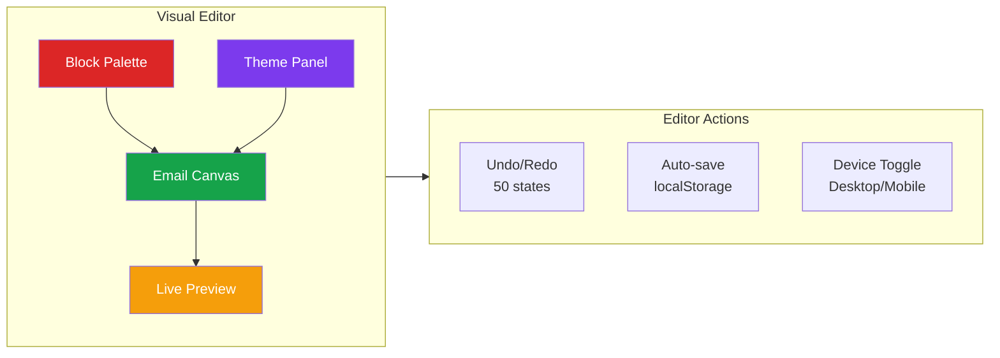
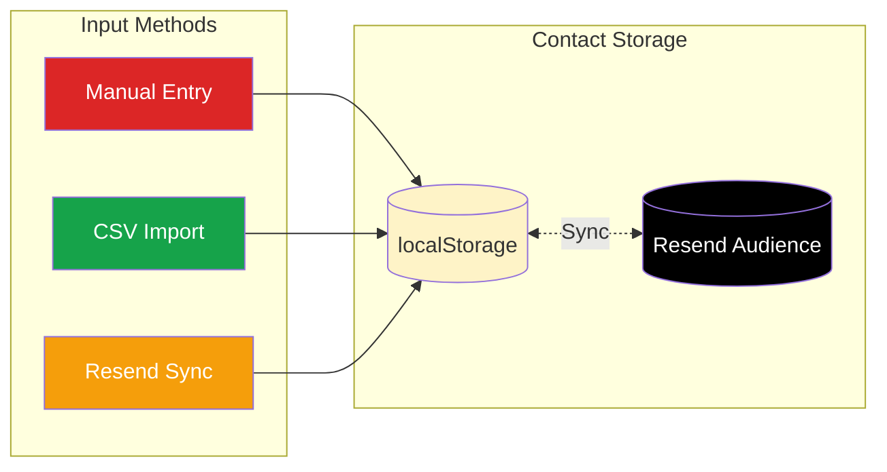
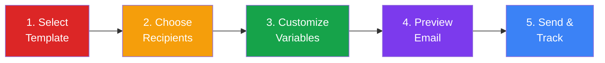
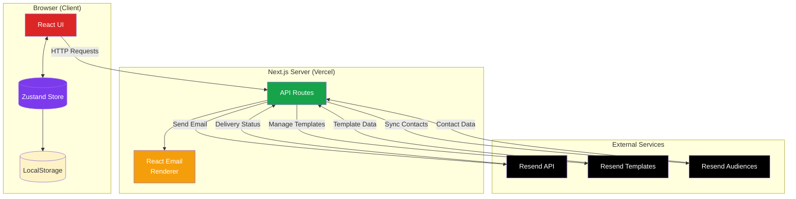
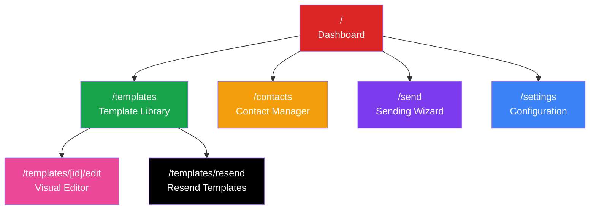
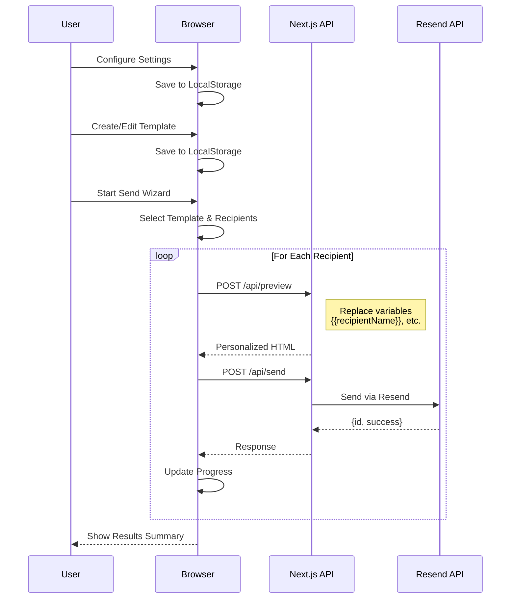
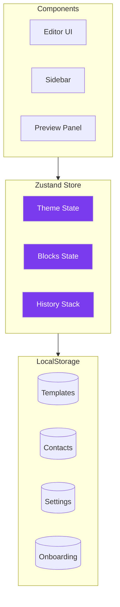
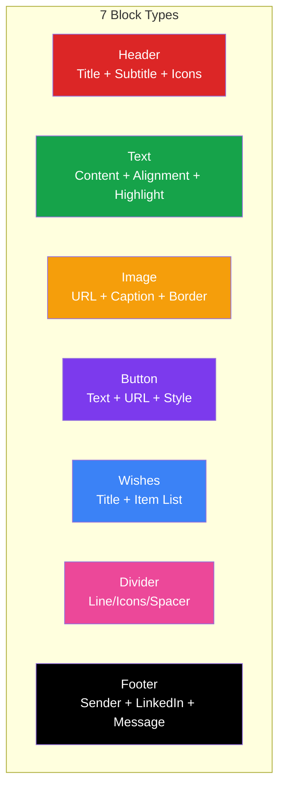
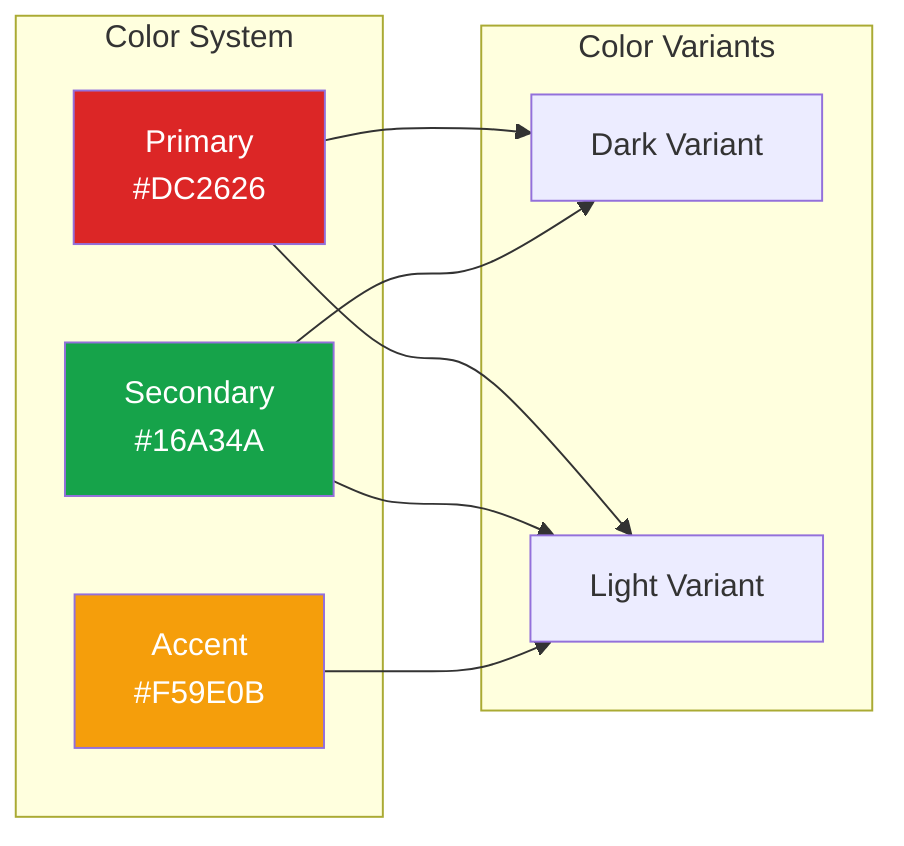
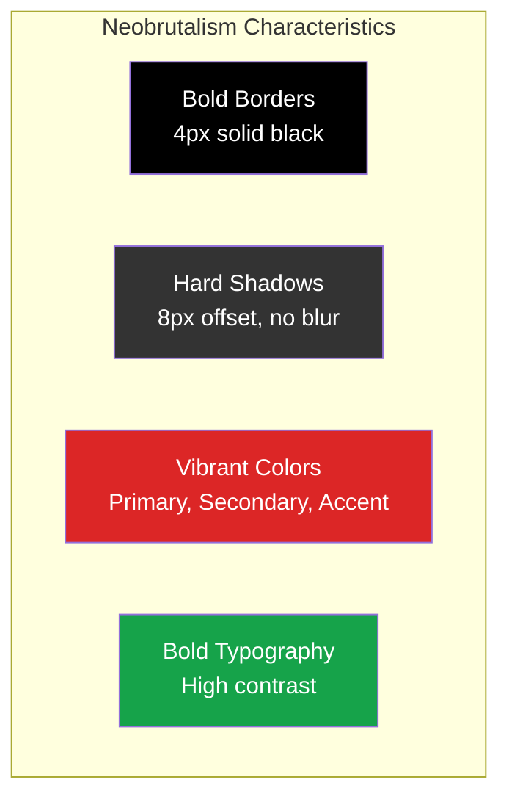

# SendJoy - Email Template Platform

<div align="center">


[](https://choosealicense.com/licenses/mit/)
[](https://nextjs.org/)
[](https://react.dev/)
[](https://www.typescriptlang.org/)
[](https://tailwindcss.com/)
[](https://resend.com/)
[](https://christmas-greeting-email.vercel.app/)

A visual email template platform for creating and sending beautiful holiday greetings, marketing emails, and newsletters. Features a bold **Neobrutalism** design style with an intuitive drag-and-drop block-based editor.

**[Live Demo](https://christmas-greeting-email.vercel.app/)** | **[Tutorial](./TUTORIAL.md)**

</div>

---

## Table of Contents

- [Features](#features)
- [System Architecture](#system-architecture)
- [Getting Started](#getting-started)
- [Tech Stack](#tech-stack)
- [Project Structure](#project-structure)
- [Template System](#template-system)
- [API Reference](#api-reference)
- [Neobrutalism Design System](#neobrutalism-design-system)
- [Security](#security)
- [Contributing](#contributing)
- [License](#license)

---

## Features

### Visual Template Editor



- **Drag-and-drop editing** - Reorder blocks with intuitive drag-and-drop using @dnd-kit
- **7 block types** - Header, Text, Image, Button, Wishes List, Divider, Footer
- **Real-time preview** - See changes instantly in the canvas
- **Device preview** - Toggle between desktop (600px) and mobile (375px) views
- **Theme customization** - 9+ color options with full color pickers
- **Undo/Redo** - Full history tracking with up to 50 states
- **Auto-save** - Templates persist to browser localStorage
- **Block visibility** - Show/hide blocks without deleting

### Email Templates

- **6 Preset Templates** - Ready-to-use professionally designed templates
- **Custom Templates** - Create new templates from scratch
- **Resend Cloud Templates** - Sync and use templates from Resend
- **Template Copying** - Duplicate any template for customization
- **Category Filtering** - Filter by Holiday, Marketing, Newsletter, or Custom

### Contact Management



- **Manual Entry** - Add contacts one by one with form validation
- **CSV Import** - Bulk import contacts (Email, FirstName, LastName columns)
- **Resend Sync** - Import contacts from Resend Audiences
- **Edit & Delete** - Full CRUD operations with modal dialogs
- **Search** - Filter contacts by email, first name, or last name

### Email Sending Wizard



- **5-Step Wizard** - Guided process from template to send
- **Template Selection** - Choose from presets, custom, or Resend templates
- **Recipient Selection** - Choose individual or all contacts
- **Personalization** - Dynamic variables like `{{recipientName}}`
- **Real Preview** - See actual rendered email before sending
- **Progress Tracking** - Visual progress bar during batch sending
- **Result Summary** - Per-recipient success/failure reporting

### User Experience

- **No coding required** - Visual interface for non-technical users
- **Welcome onboarding** - Guided setup for first-time users
- **Setup progress tracking** - Visual checklist of configuration steps
- **Help system** - Context-aware help modal
- **Responsive layout** - Works on desktop and tablet
- **Independent scrolling** - Sidebar and main content scroll separately

---

## System Architecture

### High-Level Overview



### Page Navigation



### Email Sending Flow



### State Management



---

## Getting Started

### Option 1: Use the Deployed Version (Recommended)

1. Visit **[https://christmas-greeting-email.vercel.app/](https://christmas-greeting-email.vercel.app/)**
2. Go to **Settings** and enter your Resend API Key
3. Add your contacts (manually, CSV, or sync from Resend)
4. Choose a template and customize it
5. Use the Send wizard to send emails!

### Option 2: Run Locally

```bash
# Clone the repository
git clone https://github.com/ChanMeng666/christmas-greeting-email.git
cd christmas-greeting-email

# Install dependencies
npm install

# Start development server
npm run dev

# Open http://localhost:3000
```

### Option 3: Deploy Your Own

[](https://vercel.com/new/clone?repository-url=https://github.com/ChanMeng666/christmas-greeting-email)

---

## Tech Stack

### Frontend

| Technology | Version | Purpose |
|------------|---------|---------|
| [Next.js](https://nextjs.org/) | 15.1.2 | React framework with App Router |
| [React](https://react.dev/) | 19.0.0 | UI component library |
| [TypeScript](https://www.typescriptlang.org/) | 5.7 | Type safety |
| [Tailwind CSS](https://tailwindcss.com/) | 3.4 | Utility-first CSS |
| [shadcn/ui](https://ui.shadcn.com/) | latest | UI component system |
| [Lucide React](https://lucide.dev/) | 0.468 | Icon library |
| [@dnd-kit](https://dndkit.com/) | 6.1+ | Drag-and-drop functionality |
| [Zustand](https://zustand-demo.pmnd.rs/) | 5.0.2 | State management |

### Backend & Services

| Technology | Version | Purpose |
|------------|---------|---------|
| [React Email](https://react.email/) | 0.0.31 | Email template rendering |
| [Resend](https://resend.com/) | 4.0.1 | Email delivery API |
| [Vercel](https://vercel.com/) | - | Hosting & serverless functions |

### Additional Libraries

| Library | Purpose |
|---------|---------|
| Radix UI | Unstyled UI primitives |
| class-variance-authority | CSS variant management |
| tailwind-merge | Tailwind class merging |
| tailwindcss-animate | Animation plugin |
| clsx | Conditional class names |

---

## Project Structure

```
christmas-greeting-email/
├── app/                              # Next.js App Router
│   ├── page.tsx                      # Dashboard homepage
│   ├── layout.tsx                    # Root layout with sidebar
│   ├── globals.css                   # Global styles + Tailwind
│   │
│   ├── templates/                    # Template pages
│   │   ├── page.tsx                  # Template library with filtering
│   │   ├── resend/page.tsx           # Resend cloud templates
│   │   └── [id]/edit/page.tsx        # Visual editor with undo/redo
│   │
│   ├── contacts/page.tsx             # Contact management with CSV
│   ├── send/page.tsx                 # 5-step sending wizard
│   ├── settings/page.tsx             # Configuration page
│   │
│   └── api/                          # API Routes
│       ├── send/route.ts             # Email sending endpoint
│       ├── preview/route.ts          # Template rendering
│       ├── contacts/route.ts         # Resend contacts sync
│       └── resend-templates/         # Resend template management
│           ├── route.ts              # List templates
│           └── [id]/
│               ├── route.ts          # Update template
│               ├── duplicate/route.ts
│               └── publish/route.ts
│
├── components/                       # React Components
│   ├── ui/                           # shadcn/ui components
│   │   ├── button.tsx
│   │   ├── card.tsx
│   │   ├── input.tsx
│   │   ├── label.tsx
│   │   ├── skeleton.tsx
│   │   ├── toast.tsx
│   │   └── toaster.tsx
│   │
│   ├── shared/                       # Shared components
│   │   ├── Sidebar.tsx               # Navigation sidebar
│   │   ├── MobileHeader.tsx          # Mobile top bar
│   │   ├── Breadcrumb.tsx            # Breadcrumb navigation
│   │   ├── EmptyState.tsx            # Empty state UI
│   │   ├── SmartAlert.tsx            # Smart alerts
│   │   └── DeveloperBadge.tsx        # Developer info badge
│   │
│   ├── help/                         # Help system
│   │   ├── HelpButton.tsx
│   │   └── HelpModal.tsx
│   │
│   ├── onboarding/                   # Onboarding flow
│   │   └── WelcomeModal.tsx
│   │
│   ├── progress/                     # Progress tracking
│   │   └── SetupProgress.tsx
│   │
│   └── settings/                     # Settings components
│       └── ApiKeySetupGuide.tsx
│
├── contexts/                         # React Contexts
│   └── MobileNavContext.tsx          # Mobile navigation state
│
├── hooks/                            # Custom Hooks
│   └── useOnboarding.ts              # Onboarding state management
│
├── lib/                              # Utilities
│   ├── utils.ts                      # Common utilities
│   ├── error-messages.ts             # Error message definitions
│   └── help-content.ts               # Help documentation
│
├── types/                            # TypeScript Definitions
│   └── template.ts                   # Template & theme types
│
├── public/                           # Static Assets
│   ├── christmas-greeting-email-logo.svg
│   └── chan_logo.svg
│
├── src/                              # Legacy CLI code (deprecated)
│
├── package.json
├── tsconfig.json
├── tailwind.config.ts
├── next.config.js
├── README.md
├── TUTORIAL.md
└── LICENSE
```

---

## Template System

### Preset Templates

| Template | Category | Description |
|----------|----------|-------------|
| Classic Christmas | Holiday | Red and green Neobrutalism Christmas greeting |
| New Year 2025 | Holiday | Purple and gold celebration theme |
| Chinese New Year | Holiday | Traditional red and gold with Year of the Snake |
| Birthday Wishes | Holiday | Pink and purple colorful celebration |
| Product Launch | Marketing | Gold and blue bold announcement |
| Weekly Newsletter | Newsletter | Green professional digest layout |

### Block Types



| Block | Description | Editable Properties |
|-------|-------------|---------------------|
| **Header** | Title section | title, subtitle, showIcons, icons |
| **Text** | Paragraph content | content, alignment, highlightBox |
| **Image** | Photo or graphic | src, alt, caption, borderStyle, shadowColor |
| **Button** | Call-to-action link | text, url, style (primary/secondary/outline) |
| **Wishes List** | Bulleted list with icons | title, items (icon + text array) |
| **Divider** | Horizontal separator | style (line/icons/spacer), height |
| **Footer** | Sender signature | senderName, senderLabel, showLinkedIn, linkedInUrl, closingMessage |

### Theme Configuration



| Property | Default | Description |
|----------|---------|-------------|
| `primaryColor` | `#DC2626` | Headers, accents (red) |
| `primaryColorDark` | `#B91C1C` | Dark variant |
| `primaryColorLight` | `#FEE2E2` | Light variant |
| `secondaryColor` | `#16A34A` | Buttons, footers (green) |
| `secondaryColorDark` | `#15803D` | Dark variant |
| `secondaryColorLight` | `#DCFCE7` | Light variant |
| `accentColor` | `#F59E0B` | Highlights (gold) |
| `accentColorLight` | `#FEF3C7` | Light variant |
| `backgroundColor` | `#1a1a2e` | Email body background |
| `surfaceColor` | `#FFFBEB` | Content area background |
| `textColor` | `#000000` | Body text color |
| `borderColor` | `#000000` | Neobrutalism borders |
| `borderWidth` | `4` | Border thickness (px) |
| `shadowOffset` | `8` | Hard shadow offset (px) |
| `fontFamily` | `Georgia, serif` | Font family |

### Personalization Variables

| Variable | Description | Example Output |
|----------|-------------|----------------|
| `{{recipientName}}` | Recipient's first name or email prefix | "John" |
| `{{senderName}}` | Configured sender name | "Jane Smith" |
| `{{currentYear}}` | Current year | "2025" |
| `{{nextYear}}` | Next year | "2026" |

**Syntax Support:**
- Local preview syntax: `{{variableName}}` (camelCase)
- Resend template syntax: `{{{VARIABLE_NAME}}}` (UPPER_SNAKE_CASE)

---

## API Reference

### POST `/api/send`

Send an email via Resend.

```typescript
// Request body
{
  apiKey: string,      // Resend API key
  from: string,        // Sender email (verified domain)
  to: string | string[], // Recipient email(s)
  subject: string,     // Email subject
  html: string         // Rendered HTML content
}

// Response
{
  success: boolean,
  data?: { id: string },
  error?: string
}
```

### POST `/api/preview`

Render template blocks to HTML.

```typescript
// Request body
{
  blocks: EmailBlock[],         // Content blocks
  theme: ThemeConfig,           // Theme configuration
  variables: Record<string, string>  // Personalization variables
}

// Response
{
  success: boolean,
  html: string
}
```

### GET `/api/contacts`

List contacts from Resend Audiences.

```typescript
// Query params
?apiKey=re_xxx&audienceId=dc18b68d-xxx

// Response
{
  success: boolean,
  contacts: Array<{
    email: string,
    first_name?: string,
    last_name?: string
  }>
}
```

### POST/DELETE `/api/contacts`

Add or remove contacts from Resend Audience.

```typescript
// POST Request body (add contact)
{
  apiKey: string,
  audienceId: string,
  email: string,
  firstName?: string,
  lastName?: string
}

// DELETE Request body (remove contact)
{
  apiKey: string,
  audienceId: string,
  email: string
}
```

### GET `/api/resend-templates`

List all Resend cloud templates.

```typescript
// Query params
?apiKey=re_xxx

// Response
{
  success: boolean,
  templates: Array<{
    id: string,
    name: string,
    created_at: string
  }>
}
```

### POST `/api/resend-templates/[id]/duplicate`

Duplicate a Resend template.

### POST `/api/resend-templates/[id]/publish`

Publish a Resend template.

---

## Neobrutalism Design System

### Design Principles



### Custom Tailwind Colors

```css
neo-red: #DC2626
neo-red-dark: #B91C1C
neo-green: #16A34A
neo-green-dark: #15803D
neo-gold: #F59E0B
neo-cream: #FEF3C7
neo-warm: #FFFBEB
```

### Shadow Utilities

```css
shadow-neo-sm: 2px 2px 0px black
shadow-neo: 4px 4px 0px black
shadow-neo-lg: 8px 8px 0px black
shadow-neo-red: 4px 4px 0px #DC2626
shadow-neo-green: 4px 4px 0px #16A34A
shadow-neo-gold: 4px 4px 0px #F59E0B
```

---

## Data Storage

All data is stored in browser localStorage (no server-side storage):

| Key | Content |
|-----|---------|
| `email-platform-templates` | Custom templates |
| `email-platform-contacts` | Local contacts |
| `email-platform-settings` | API key, sender info |
| `email-platform-onboarding` | First-visit and progress state |
| `email-platform-emails-sent` | Send count |
| `email-platform-sidebar-collapsed` | Sidebar collapse state |

---

## Security

### Data Storage
- **All data stored locally** - Settings, contacts, templates in browser localStorage
- **No server-side storage** - Nothing persisted on the server
- **API keys sent per-request** - Not stored on server, sent directly to Resend

### Best Practices
- Use different Resend API keys for development/production
- Verify your sending domain in Resend for production use
- Never commit `.env` files to version control
- Delete and recreate API keys if you suspect compromise

---

## Contributing

Contributions are welcome! Please feel free to submit a Pull Request.

1. Fork the repository
2. Create your feature branch (`git checkout -b feature/AmazingFeature`)
3. Commit your changes (`git commit -m 'Add some AmazingFeature'`)
4. Push to the branch (`git push origin feature/AmazingFeature`)
5. Open a Pull Request

---

## License

This project is licensed under the MIT License - see the [LICENSE](LICENSE) file for details.

---

## Author

<div align="center">

**Chan Meng**

[](https://chanmeng.live/)
[](https://www.linkedin.com/in/chanmeng666/)
[](https://github.com/ChanMeng666)

</div>

---

## Acknowledgments

- [Resend](https://resend.com/) - Email delivery API
- [React Email](https://react.email/) - Email template components
- [shadcn/ui](https://ui.shadcn.com/) - Beautiful UI components
- [@dnd-kit](https://dndkit.com/) - Drag and drop toolkit
- [Zustand](https://zustand-demo.pmnd.rs/) - State management
- [Vercel](https://vercel.com/) - Hosting platform
