# Christmas Greeting Email

[](https://choosealicense.com/licenses/mit/)
[](https://nodejs.org/)
[](https://www.typescriptlang.org/)
[](https://resend.com/)

A Node.js application for sending beautifully designed Christmas greeting emails using [Resend](https://resend.com). Features a bold **Neobrutalism** design style with festive red and green colors.


## Features

- **Neobrutalism Design** - Bold 3-5px black borders, hard offset shadows (no blur), high-contrast colors
- **Christmas Theme** - Festive red (#DC2626) and green (#16A34A) color palette with gold accents
- **React Email Templates** - Type-safe, component-based email design
- **Email Preview** - Preview emails in browser before sending
- **Resend Integration** - Reliable email delivery via Resend API
- **Contact Management** - Manage recipients with Resend Audiences
- **Batch Sending** - Send personalized emails to multiple recipients

## Quick Start

```bash
# 1. Clone the repository
git clone https://github.com/ChanMeng666/christmas-greeting-email.git
cd christmas-greeting-email

# 2. Install dependencies
npm install

# 3. Configure environment (see Resend Setup Guide below)
cp .env.example .env

# 4. Preview your email
npm run preview
```

---

## Resend Setup Guide

This section guides you through setting up Resend for email delivery.

### Step 1: Create a Resend Account

1. Visit [resend.com/signup](https://resend.com/signup)
2. Sign up with your email or GitHub account
3. Verify your email address

### Step 2: Verify Your Domain

To send emails from your own domain (e.g., `hello@yourdomain.com`), you need to verify it:

1. Go to [Resend Dashboard → Domains](https://resend.com/domains)
2. Click **Add Domain**
3. Enter your domain name (e.g., `yourdomain.com`)
4. Add the required DNS records to your domain provider:

| Type | Name | Value |
|------|------|-------|
| TXT | `resend._domainkey` | `(provided by Resend)` |
| TXT | `@` or `_resend` | `(provided by Resend)` |
| MX | `@` (optional) | `(for receiving replies)` |

5. Wait for DNS propagation (usually 5-30 minutes)
6. Click **Verify** in Resend Dashboard

> **Note**: You can use `onboarding@resend.dev` for testing without domain verification, but it only sends to your registered email.

### Step 3: Get Your API Key

1. Go to [Resend Dashboard → API Keys](https://resend.com/api-keys)
2. Click **Create API Key**
3. Give it a name (e.g., "Christmas Email")
4. Select permissions:
   - **Full access** - For sending emails and managing contacts
   - **Sending access only** - For sending emails only
5. Copy and save your API key securely (it won't be shown again)

### Step 4: Create an Audience (Contact List)

Audiences store your email recipients:

1. Go to [Resend Dashboard → Audiences](https://resend.com/audiences)
2. Click **Create Audience**
3. Enter a name (e.g., "Christmas Greetings 2025")
4. Copy the **Audience ID** (looks like `dc18b68d-cd0a-4c17-baf5-8de8edbf50fa`)

### Step 5: Configure Environment Variables

Edit your `.env` file:

```env
RESEND_API_KEY=re_xxxxxxxxxxxxxxxxxxxxxxxxxxxxxxxxxx
SENDER_EMAIL=hello@yourdomain.com
SENDER_NAME=Your Name
```

Edit `src/config.ts` for additional settings:

```typescript
export const config = {
  // Your Resend Audience ID
  audienceId: 'your-audience-id-here',

  // Your LinkedIn profile
  linkedin: 'https://www.linkedin.com/in/yourprofile/',

  // Email subject line
  emailSubject: "🎄 Season's Greetings from Your Name!",

  // Image URLs (use publicly accessible URLs)
  personalImageUrl: 'https://example.com/your-image.png',
  festiveImageUrl: 'https://example.com/festive-image.png',
  stickerImageUrl: 'https://example.com/sticker.png',
};
```

---

## Project Architecture

### File Dependencies


### Email Sending Workflow


---

## Email Template Customization

### Template Location

The email template is located at `src/templates/christmas-email.tsx`.

### Template Structure

```mermaid
graph TD
    A["Top Decoration Bar<br/>❄️ ⭐ 🔔"] --> B["Main Title<br/>MERRY CHRISTMAS"]
    B --> C["Icon Bar<br/>🎄 🎁 🔔"]
    C --> D["Personal Photo<br/>(with Neobrutalist frame)"]
    D --> E["Greeting Section<br/>Dear [Name],"]
    E --> F["Message Body<br/>(Main content)"]
    F --> G["Wishes List<br/>⭐ Your wishes..."]
    G --> H["Festive Image<br/>(Second image)"]
    H --> I["Sender Card<br/>(Name + LinkedIn)"]
    I --> J["Bottom Banner<br/>🎁 ⭐ 🎄"]

    style A fill:#16A34A,color:#fff
    style B fill:#DC2626,color:#fff
    style C fill:#FEF3C7
    style D fill:#FEE2E2
    style E fill:#DCFCE7
    style F fill:#FFFBEB
    style G fill:#FEE2E2
    style H fill:#DCFCE7
    style I fill:#16A34A,color:#fff
    style J fill:#DC2626,color:#fff
```



### Customize Colors

Edit the `colors` object in `src/templates/christmas-email.tsx`:

```typescript
const colors = {
  christmasRed: '#DC2626',      // Primary red
  christmasRedDark: '#B91C1C',  // Dark red (hover/accent)
  christmasRedLight: '#FEE2E2', // Light red (backgrounds)
  christmasGreen: '#16A34A',    // Primary green
  christmasGreenDark: '#15803D',// Dark green
  christmasGreenLight: '#DCFCE7',// Light green (backgrounds)
  gold: '#F59E0B',              // Gold accent
  goldLight: '#FEF3C7',         // Light gold
  black: '#000000',             // Borders
  cream: '#FEF3C7',             // Background
  warmWhite: '#FFFBEB',         // Content background
  white: '#FFFFFF',             // Pure white
};
```

### Modify Email Content

**Change the greeting message** (around line 479):

```typescript
<Text style={styles.messageText}>
  Your custom message here...
</Text>
```

**Modify wishes list** (around line 507):

```typescript
<Text style={styles.wishItem}>
  {icons.star} Your custom wish
</Text>
```

**Update sender information** in `src/config.ts`:

```typescript
sender: {
  email: 'your-email@domain.com',
  name: 'Your Name',
},
linkedin: 'https://linkedin.com/in/yourprofile',
```

### Replace Images

All images should be publicly accessible URLs. Update in `src/config.ts`:

| Property | Purpose | Recommended Size |
|----------|---------|------------------|
| `personalImageUrl` | Main greeting image | 480×320px |
| `festiveImageUrl` | Secondary festive image | 480×320px |
| `stickerImageUrl` | Decorative sticker | 200×200px (transparent PNG) |

### Neobrutalism Design Elements

The template uses these Neobrutalism characteristics:

| Element | Style |
|---------|-------|
| **Borders** | 3-5px solid black (`border: 5px solid #000000`) |
| **Shadows** | Hard offset, no blur (`box-shadow: 12px 12px 0px #000000`) |
| **Colors** | High saturation, high contrast |
| **Typography** | Bold weights (700-900), uppercase headings |
| **Decorations** | Emoji icons for cross-client compatibility |

---

## Contact Management

### CLI Commands

```bash
# List all contacts in your Audience
npm run contacts:list

# Add a contact interactively
npm run contacts:add
```

### Using Resend Dashboard

You can also manage contacts directly at [resend.com/audiences](https://resend.com/audiences):

1. Select your Audience
2. Click **Add Contact** or **Import**
3. Enter email, first name, last name

### Bulk Import

For bulk import, you can:
1. Use Resend Dashboard's import feature (CSV upload)
2. Write a custom script using the Resend SDK:

```typescript
import { Resend } from 'resend';
const resend = new Resend('your-api-key');

const contacts = [
  { email: 'john@example.com', firstName: 'John' },
  { email: 'jane@example.com', firstName: 'Jane' },
];

for (const contact of contacts) {
  await resend.contacts.create({
    audienceId: 'your-audience-id',
    email: contact.email,
    firstName: contact.firstName,
  });
}
```

---

## Sending Emails

### Preview Email

Preview your email in the browser before sending:

```bash
npm run preview
```

Opens at `http://localhost:3007` with:
- **Preview mode**: Styled email preview
- **Raw HTML mode**: View source HTML (`/raw`)

### Send Test Email

Send a test email to your own address:

```bash
npm run send:test
```

This sends one email to the `SENDER_EMAIL` address configured in `.env`.

### Batch Send to All Contacts

Send to all contacts in your Audience:

```bash
npm run send
```

**Safety features:**
- Confirmation prompt before sending
- 200ms delay between emails (rate limiting)
- Success/failure summary after completion

### Resend API Usage

The project uses the Resend SDK:

```typescript
import { Resend } from 'resend';

const resend = new Resend(process.env.RESEND_API_KEY);

// Send email
const { data, error } = await resend.emails.send({
  from: 'Your Name <hello@yourdomain.com>',
  to: ['recipient@example.com'],
  subject: "🎄 Season's Greetings!",
  html: emailHtml,
});

// Manage contacts
await resend.contacts.create({
  audienceId: 'your-audience-id',
  email: 'new@example.com',
  firstName: 'New',
  lastName: 'User',
});
```

---

## Tech Stack

| Technology | Version | Purpose |
|------------|---------|---------|
| [Node.js](https://nodejs.org/) | 18+ | JavaScript runtime |
| [TypeScript](https://www.typescriptlang.org/) | 5.7 | Type safety |
| [React](https://react.dev/) | 19.0 | Component framework |
| [React Email](https://react.email/) | 0.0.31 | Email component library |
| [Resend](https://resend.com/) | 4.0.1 | Email delivery API |
| [tsx](https://github.com/privatenumber/tsx) | 4.19.2 | TypeScript execution |
| [dotenv](https://github.com/motdotla/dotenv) | 16.4.7 | Environment variables |

---

## Project Structure

```
christmas-greeting-email/
├── src/
│   ├── config.ts              # Configuration (API keys, colors, URLs)
│   ├── index.ts               # Main entry - email sending logic
│   ├── contacts.ts            # Contact management CLI
│   ├── preview.ts             # Local preview HTTP server
│   └── templates/
│       └── christmas-email.tsx # React Email template
├── .env.example               # Environment variables template
├── .env                       # Your environment variables (git-ignored)
├── package.json               # Dependencies and scripts
├── tsconfig.json              # TypeScript configuration
└── README.md                  # This file
```

---

## FAQ

### Q: Email sending fails with "Invalid API key"

**A:** Check that:
1. Your API key in `.env` starts with `re_`
2. There are no extra spaces or quotes around the key
3. The API key has "Full access" or "Sending access" permissions

### Q: Email not delivered / goes to spam

**A:** Common solutions:
1. Verify your domain in Resend Dashboard
2. Add SPF and DKIM records to your DNS
3. Use a professional sender email (not personal Gmail)
4. Avoid spam trigger words in subject/content

### Q: Images not displaying in email

**A:** Ensure:
1. Image URLs are publicly accessible (no authentication required)
2. URLs use HTTPS (not HTTP)
3. Images are hosted on reliable CDN (Vercel Blob, Cloudinary, AWS S3)
4. Image files are not too large (< 1MB recommended)

### Q: How to add more decorative elements?

**A:** Use emoji for best compatibility across email clients:

```typescript
const icons = {
  christmasTree: '🎄',
  snowflake: '❄️',
  gift: '🎁',
  star: '⭐',
  bell: '🔔',
  heart: '❤️',
  // Add more as needed
};
```

### Q: Can I use custom fonts?

**A:** Email clients have limited font support. The template uses web-safe fonts:

```css
font-family: 'Trebuchet MS', 'Lucida Grande', Tahoma, sans-serif;
```

Using custom web fonts may not render in all email clients.

### Q: How to change the preview server port?

**A:** Edit `src/preview.ts`:

```typescript
const PORT = 3007; // Change to your preferred port
```

---

## Author

**Chan Meng**
- LinkedIn: [chanmeng666](https://www.linkedin.com/in/chanmeng666/)
- GitHub: [ChanMeng666](https://github.com/ChanMeng666)

---

## License

[MIT License](LICENSE) - Feel free to use this project for your own holiday greetings!
