# SendJoy - Email Template Platform User Tutorial

This comprehensive guide will walk you through every feature of SendJoy, from initial setup to sending your first email campaign.

## Table of Contents

1. [Getting Started](#1-getting-started)
2. [Setting Up Your Account](#2-setting-up-your-account)
3. [Managing Contacts](#3-managing-contacts)
4. [Working with Templates](#4-working-with-templates)
5. [Using the Visual Editor](#5-using-the-visual-editor)
6. [Sending Emails](#6-sending-emails)
7. [Troubleshooting](#7-troubleshooting)
8. [FAQ](#8-faq)

---

## 1. Getting Started

### 1.1 Accessing the Platform

You can access SendJoy in two ways:

**Option A: Use the Live Version (Recommended)**

Simply visit: **[https://send-joy.vercel.app/](https://send-joy.vercel.app/)**

No installation or download required!

**Option B: Run Locally**

If you prefer to run the platform on your own computer:

```bash
git clone https://github.com/ChanMeng666/send-joy.git
cd send-joy
npm install
npm run dev
```

Then open `http://localhost:3000` in your browser.

### 1.2 First-Time User Experience

When you first visit SendJoy, you'll see a Welcome Modal that guides you through the platform:

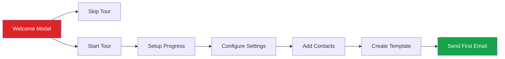

### 1.3 Platform Overview

The Dashboard provides quick access to all main features:

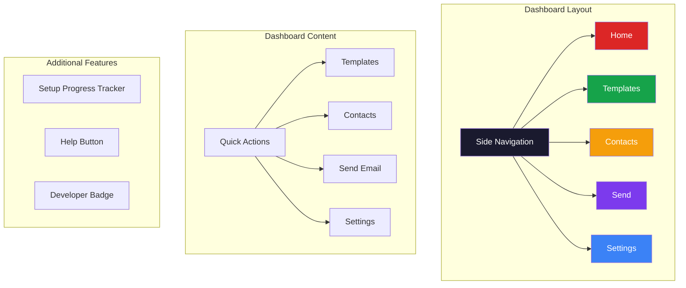

**Navigation Sidebar** (left side):
- **Home** - Dashboard overview with quick actions and setup progress
- **Templates** - Browse, create, and edit email templates
- **Contacts** - Manage your recipients
- **Send** - 5-step email sending wizard
- **Settings** - Configure API keys and sender info

**Additional Features:**
- **Help Button** - Context-aware help modal with documentation
- **Setup Progress** - Visual checklist tracking your configuration status
- **Developer Badge** - Information about the platform author

---

## 2. Setting Up Your Account

Before you can send emails, you need to configure your Resend API settings.

### 2.1 Getting a Resend API Key

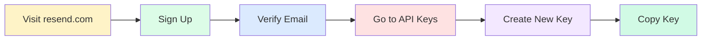

**Step-by-step instructions:**

1. **Visit Resend**: Go to [resend.com](https://resend.com)
2. **Create an Account**: Click "Sign Up" and register with your email
3. **Verify Your Email**: Check your inbox and click the verification link
4. **Navigate to API Keys**: Go to [resend.com/api-keys](https://resend.com/api-keys)
5. **Create a New Key**:
   - Click "Create API Key"
   - Give it a name (e.g., "SendJoy Platform")
   - Select "Full access" for permissions
   - Click "Create"
6. **Copy Your Key**: Your API key will look like `re_xxxxxxxxxx`

> **Important**: Save your API key securely. It will only be shown once!

### 2.2 Verifying Your Domain (Optional but Recommended)

To send emails from your own domain (e.g., `hello@yourdomain.com`):

1. Go to [resend.com/domains](https://resend.com/domains)
2. Click "Add Domain"
3. Enter your domain name
4. Add the DNS records provided by Resend:

| Type | Name | Value |
|------|------|-------|
| TXT | `resend._domainkey` | (provided by Resend) |
| TXT | `@` or `_resend` | (provided by Resend) |

5. Wait 5-30 minutes for DNS propagation
6. Click "Verify" in Resend Dashboard

> **Tip**: If you don't have a domain, you can use `onboarding@resend.dev` for testing (only sends to your own email).

### 2.3 Configuring the Platform

1. Click **Settings** in the sidebar
2. Fill in the following fields:

| Field | Description | Example |
|-------|-------------|---------|
| **Resend API Key** | Your API key from Step 2.1 | `re_AbCdEf123456...` |
| **Sender Email** | Your verified sender address | `hello@yourdomain.com` |
| **Sender Name** | Display name for recipients | `John Smith` |
| **Audience ID** (optional) | For syncing contacts from Resend Audiences | `dc18b68d-cd0a-4c17-baf5-8de8edbf50fa` |

> **How to find your Audience ID:**
> 1. Go to [resend.com/audiences](https://resend.com/audiences)
> 2. Click on the audience you want to use
> 3. Copy the ID from the URL or the details panel

3. Click **Save Settings**

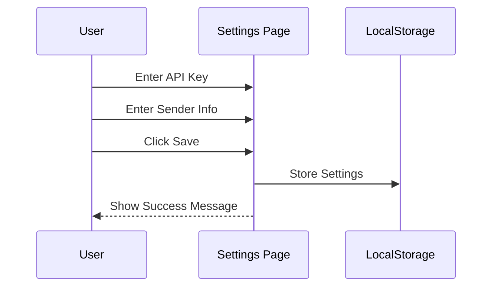

### 2.4 Setup Progress Tracking

The Dashboard shows your setup progress with a visual checklist:

- **Configure API Key** - Add your Resend API key
- **Set Sender Email** - Configure your sender address
- **Add Contacts** - Add at least one recipient
- **Create Template** - Customize or create a template
- **Send First Email** - Successfully send your first email

Each step shows a checkmark when completed, helping you track your configuration status.

---

## 3. Managing Contacts

The Contacts page lets you manage all your email recipients with full CRUD capabilities.

### 3.1 Adding Contacts Manually

1. Go to **Contacts** in the sidebar
2. Click the **Add Contact** button
3. Fill in the contact information:
   - **Email** (required)
   - **First Name** (optional)
   - **Last Name** (optional)
4. Click **Add Contact**

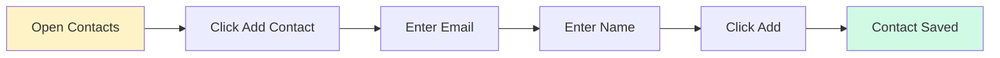

### 3.2 Editing Contacts

1. Find the contact in the list
2. Click the **Edit** icon (pencil) on the right
3. A modal dialog will appear with the contact's current information
4. Modify the email, first name, or last name
5. Click **Save Changes**

### 3.3 Deleting Contacts

1. Find the contact in the list
2. Click the **Delete** icon (trash) on the right
3. Confirm the deletion in the dialog
4. The contact will be removed

### 3.4 Searching Contacts

Use the search bar at the top to filter contacts by:
- Email address
- First name
- Last name

The list updates in real-time as you type.

### 3.5 Importing from CSV

Bulk import contacts from a spreadsheet file:

1. Click the **Import CSV** button
2. Select a CSV file from your computer
3. The system will automatically detect columns:
   - **email** - Required column
   - **firstName**, **first_name**, or **name** - Optional
   - **lastName**, **last_name**, or **surname** - Optional
4. New contacts are added (duplicates are skipped)
5. A success message shows how many were imported

**Expected CSV format:**
```csv
email,firstName,lastName
john@example.com,John,Doe
jane@example.com,Jane,Smith
bob@company.com,Bob,Johnson
```

**Notes:**
- The first row must be headers
- Quoted values are supported
- Invalid emails are skipped
- Existing emails are not duplicated

### 3.6 Syncing with Resend Audiences

If you have an Audience ID configured in Settings:

1. Click the **Sync from Resend** button
2. The platform fetches contacts from your Resend Audience
3. New contacts are merged with your existing list
4. A success message shows how many were imported

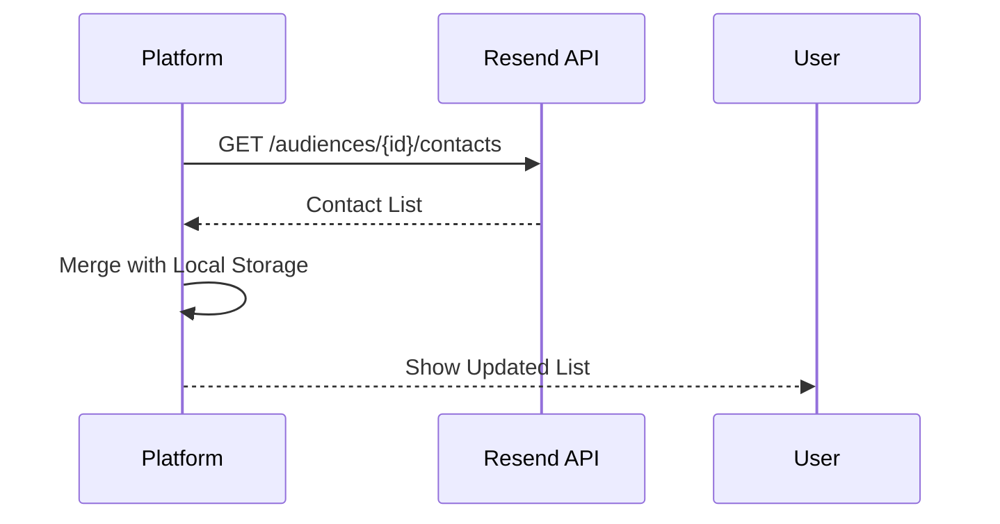

---

## 4. Working with Templates

The Templates page displays all available email templates with filtering and management capabilities.

### 4.1 Template Categories

Templates are organized into four categories:

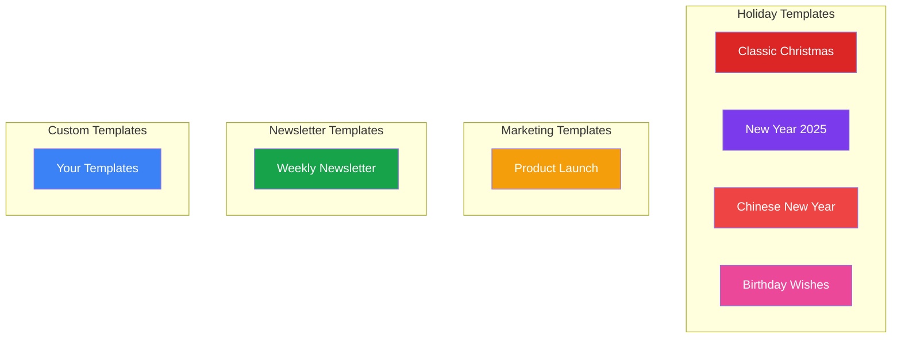

### 4.2 Browsing Templates

1. Go to **Templates** in the sidebar
2. Use the filter tabs to narrow down:
   - **All** - Show all templates (preset + custom)
   - **Holiday** - Greeting cards and celebrations
   - **Marketing** - Promotional emails
   - **Newsletter** - Regular updates
   - **Custom** - Your created/copied templates
3. The count badge shows how many templates match each filter
4. Hover over a template card to see action buttons

### 4.3 Creating a New Template

1. Click the **Create Template** button (top right)
2. A new blank template is created with:
   - Default header block
   - Text block with placeholder
   - Footer block
3. You're automatically redirected to the visual editor
4. Customize the template to your needs
5. Click **Save** to keep your changes

### 4.4 Copying a Template

Duplicate any template (preset or custom) to create your own version:

1. Hover over the template card
2. Click the **Copy** icon
3. A new template is created with "(Copy)" suffix
4. The copy appears in your template list
5. Edit the copy without affecting the original

### 4.5 Deleting Custom Templates

Only custom templates can be deleted (presets are permanent):

1. Hover over the custom template card
2. Click the **Delete** icon (trash)
3. Confirm the deletion
4. The template is permanently removed

### 4.6 Using Resend Cloud Templates

SendJoy integrates with Resend's template system:

1. Click **Resend Templates** tab in the Templates page
2. View all templates stored in your Resend account
3. Use them directly in the Send wizard
4. Supports Resend's variable syntax: `{{{VARIABLE_NAME}}}`

---

## 5. Using the Visual Editor

The Visual Editor is the heart of the platform, allowing you to customize email templates with drag-and-drop functionality.

### 5.1 Editor Layout

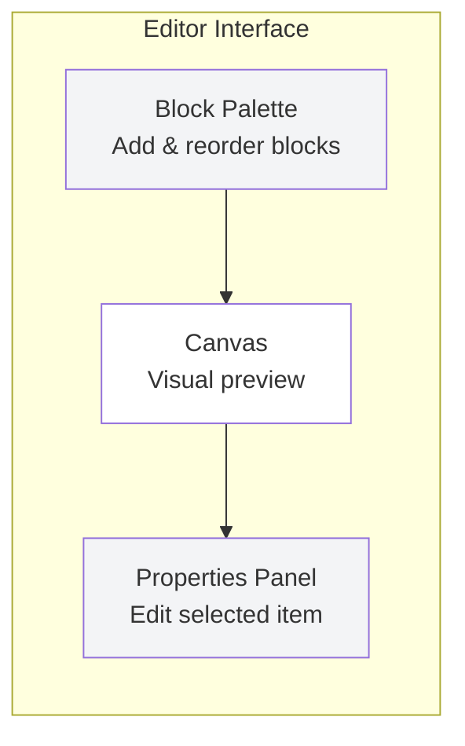

The editor has three main panels:

| Panel | Location | Purpose |
|-------|----------|---------|
| **Block Palette** | Left | Add new blocks, drag to reorder |
| **Canvas** | Center | Visual preview of your email |
| **Properties Panel** | Right | Edit selected block or theme |

### 5.2 Toolbar Features

The toolbar at the top provides:

| Button | Function |
|--------|----------|
| **Back Arrow** | Return to Templates page |
| **Template Name** | Click to rename your template |
| **Subject Line** | Edit the email subject |
| **Undo** | Undo last change (up to 50 steps) |
| **Redo** | Redo undone change |
| **Desktop** | Preview at 600px width |
| **Mobile** | Preview at 375px width |
| **Preview** | Open full email preview modal |
| **Save** | Save template to browser storage |

### 5.3 Available Blocks

| Block | Description | Properties |
|-------|-------------|------------|
| **Header** | Title and subtitle section | title, subtitle, showIcons, icons |
| **Text** | Paragraph or content | content, alignment, highlightBox |
| **Image** | Photo or graphic | src (URL), alt, caption, borderStyle, shadowColor |
| **Button** | Call-to-action link | text, url, style (primary/secondary/outline) |
| **Wishes List** | Bulleted list with icons | title, items (icon + text) |
| **Divider** | Horizontal separator | style (line/icons/spacer), height |
| **Footer** | Sender signature | senderName, senderLabel, showLinkedIn, linkedInUrl, closingMessage |

### 5.4 Drag-and-Drop Reordering

SendJoy uses @dnd-kit for intuitive drag-and-drop:

1. In the left panel, find the block you want to move
2. Click and hold the drag handle (grip icon)
3. Drag the block to its new position
4. Release to drop
5. The canvas updates immediately

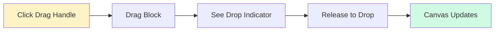

### 5.5 Adding a Block

1. In the left panel, find the block type you want under "Add Blocks"
2. Click the block row (or the + icon)
3. The block is added to the bottom of your email
4. The block is automatically selected for editing

### 5.6 Editing a Block

1. Click on any block in the canvas
2. The block will be highlighted with a colored border
3. The Properties Panel (right) shows editing options
4. Make your changes - they appear immediately in the canvas

**Example: Editing a Header Block**

| Property | Description |
|----------|-------------|
| **Subtitle** | Small text above the title |
| **Title** | Main heading text |
| **Show Icons** | Toggle decorative icons |

**Example: Editing a Footer Block**

| Property | Description |
|----------|-------------|
| **Closing Message** | Farewell text (e.g., "Best wishes") |
| **Sender Label** | Role or title (e.g., "From") |
| **Sender Name** | Your name |
| **Show LinkedIn** | Toggle LinkedIn link |
| **LinkedIn URL** | Your LinkedIn profile URL |

### 5.7 Block Visibility

Control which blocks appear in the final email:

1. Click the **eye icon** on any block in the list
2. Hidden blocks show a crossed-out eye
3. Hidden blocks are not rendered in the final email
4. Useful for preparing alternative content

### 5.8 Managing Blocks

In the left panel's "Blocks in Template" section:

- **Click** a block to select it
- **Drag** the handle to reorder
- **Eye icon** toggles visibility
- **Trash icon** removes the block

### 5.9 Deleting a Block

1. Find the block in the left panel's block list
2. Click the trash icon next to it
3. The block is immediately removed
4. Use **Undo** if you made a mistake

### 5.10 Undo and Redo

The editor maintains a history of up to 50 changes:

- **Undo** button or keyboard shortcut - Go back one step
- **Redo** button or keyboard shortcut - Go forward one step
- History is preserved until you leave the page

### 5.11 Customizing Theme

When no block is selected, the Properties Panel shows theme options:

| Property | Description |
|----------|-------------|
| **Primary Color** | Headers, accents (default: red) |
| **Primary Color Dark** | Dark variant for borders/shadows |
| **Primary Color Light** | Light variant for backgrounds |
| **Secondary Color** | Buttons, footers (default: green) |
| **Secondary Color Dark** | Dark variant |
| **Secondary Color Light** | Light variant |
| **Accent Color** | Highlights (default: gold) |
| **Accent Color Light** | Light variant |
| **Background Color** | Email body background |
| **Surface Color** | Content area background |
| **Text Color** | Body text color |
| **Border Color** | Neobrutalism borders |
| **Border Width** | Border thickness (1-10px) |
| **Shadow Offset** | Hard shadow distance (0-20px) |

Each color has:
- A **color picker** (click the square)
- A **hex input** (type exact value)

### 5.12 Using Variables

You can personalize emails using variables that get replaced when sending:

| Variable | Description | Example Output |
|----------|-------------|----------------|
| `{{recipientName}}` | Recipient's first name | "John" |
| `{{senderName}}` | Your configured name | "Jane Smith" |
| `{{currentYear}}` | Current year | "2025" |
| `{{nextYear}}` | Next year | "2026" |

**Syntax Support:**

- **Local preview syntax**: `{{variableName}}` (camelCase)
- **Resend template syntax**: `{{{VARIABLE_NAME}}}` (UPPER_SNAKE_CASE)

**Example usage in text:**
```
Dear {{recipientName}},

Wishing you a wonderful {{nextYear}}!

Best regards,
{{senderName}}
```

### 5.13 Preview Modes

**Canvas Preview:**
- Use the Desktop/Mobile toggle in the toolbar
- Desktop shows 600px width
- Mobile shows 375px width

**Full Preview:**
1. Click the **Preview** button in the toolbar
2. A modal opens with the rendered email
3. Shows exactly what recipients will see
4. Variables are replaced with sample values
5. Click X or outside to close

### 5.14 Saving Your Template

1. Click the **Save** button in the toolbar
2. The button shows "Saving..." briefly
3. Then shows "Saved!" with a checkmark
4. Your template is saved to browser localStorage
5. It will be available next time you visit

---

## 6. Sending Emails

The Send page provides a 5-step wizard to guide you through sending emails.

### 6.1 Sending Workflow

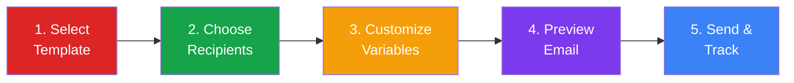

### 6.2 Step 1: Select Template

1. Go to **Send** in the sidebar
2. Choose template source:
   - **Local Templates** - Presets and your custom templates
   - **Resend Templates** - Templates from your Resend account
3. Click on the template you want to use
4. The selected template shows a highlight
5. Click **Next**

### 6.3 Step 2: Choose Recipients

1. View your contact list (loaded from Contacts page)
2. Click on contacts to select/deselect them
3. Use **Select All** to choose everyone
4. Use **Deselect All** to clear selection
5. The count shows "X of Y contacts selected"
6. Click **Next**

> **Tip**: If no contacts appear, go to the Contacts page first and add some!

### 6.4 Step 3: Customize Variables

1. Enter the email subject line
2. The subject is pre-filled from the template's default
3. Modify the subject as needed
4. You can use variables like `{{recipientName}}`
5. Example: "Happy Holidays, {{recipientName}}!"
6. Click **Next**

### 6.5 Step 4: Preview Email

1. See the actual rendered email
2. A contact selector lets you preview for different recipients
3. The subject line shows with variables replaced
4. Verify everything looks correct
5. Click **Next** to proceed to sending

### 6.6 Step 5: Send

**Before Sending:**
- Verify your settings are configured (API Key, Sender Email)
- Review the summary: From, Subject, Recipients
- A warning appears if settings are missing

**Sending Process:**
1. Click the **Send X Emails** button
2. A progress bar shows sending status
3. Each email is sent individually with personalization
4. A delay between emails prevents rate limiting

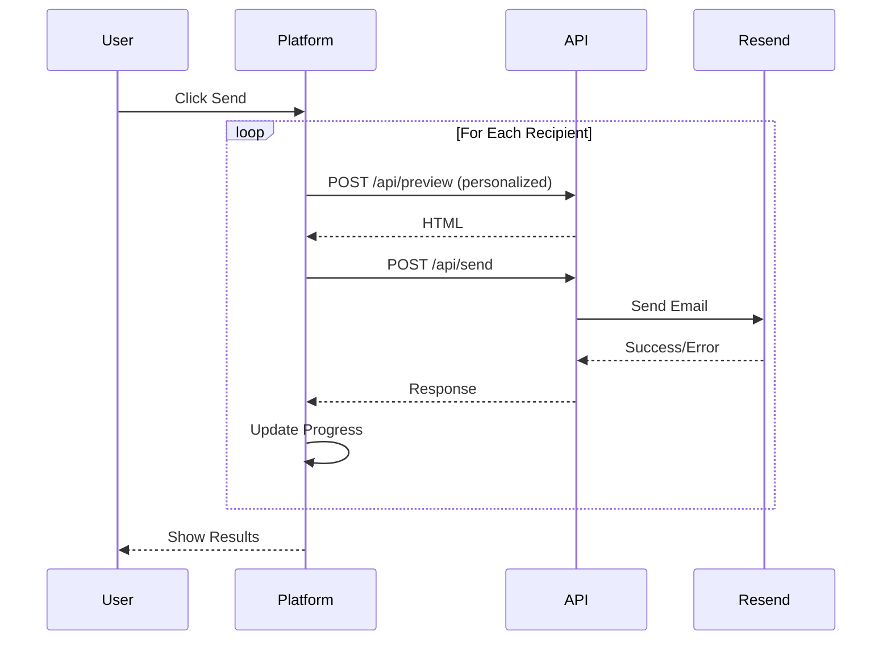

### 6.7 Understanding Send Results

After sending completes:

**Success View:**
- Green checkmark icon
- "All Emails Sent!" message
- Count of successfully sent emails

**Partial Success View:**
- Yellow warning icon
- "Sending Complete" message
- Counts for success and failure

**Results List:**
Each recipient shows:
- **Green checkmark** - Successfully sent
- **Red X** - Failed (with error message)

**Common Errors:**
- "Invalid API key" - Check your Settings
- "Domain not verified" - Verify in Resend dashboard
- "Rate limit exceeded" - Wait and try again

**After Sending:**
- Click **Back to Dashboard** to return home
- Check Resend dashboard for delivery status

---

## 7. Troubleshooting

### 7.1 Common Issues

#### "API key is required"

**Problem**: You haven't configured your Resend API key.

**Solution**:
1. Go to Settings
2. Enter your Resend API key
3. Click Save

#### "Invalid API key"

**Problem**: Your API key is incorrect or expired.

**Solution**:
1. Go to [resend.com/api-keys](https://resend.com/api-keys)
2. Create a new API key
3. Update it in Settings

#### "Domain not verified"

**Problem**: Your sender email domain isn't verified in Resend.

**Solution**:
1. Go to [resend.com/domains](https://resend.com/domains)
2. Verify your domain with DNS records
3. Or use `onboarding@resend.dev` for testing

#### "No contacts found"

**Problem**: You haven't added any contacts yet.

**Solution**:
1. Go to Contacts page
2. Add contacts manually, import CSV, or sync from Resend
3. Return to Send wizard

#### "Email not received"

**Problem**: Email may be in spam or delayed.

**Solutions**:
1. Check recipient's spam/junk folder
2. Verify the email address is correct
3. Wait a few minutes (emails can be delayed)
4. Check Resend Dashboard for delivery status

#### "Failed to render preview"

**Problem**: Template has invalid data.

**Solution**:
1. Go to the Editor and check all blocks
2. Ensure image URLs are valid HTTPS links
3. Save the template and try again

### 7.2 Browser Issues

#### Data Lost After Closing Browser

**Problem**: Your browser may be clearing localStorage.

**Solutions**:
1. Disable "Clear data on close" in browser settings
2. Don't use Incognito/Private mode
3. Allow site data for this website

#### Page Not Loading

**Solutions**:
1. Clear browser cache
2. Try a different browser (Chrome, Firefox, Edge)
3. Disable ad blockers
4. Check internet connection

#### Slow Performance

**Solutions**:
1. Close other browser tabs
2. Clear browser cache
3. Use a modern browser version

---

## 8. FAQ

### General Questions

**Q: Is this platform free to use?**

A: Yes, SendJoy is completely free. However, you need a Resend account for sending emails. Resend offers a free tier with 3,000 emails/month.

**Q: Do I need to install anything?**

A: No! Just visit the website and start using it. No downloads or installations required.

**Q: Where is my data stored?**

A: All your data (settings, contacts, templates) is stored in your browser's localStorage. It's never uploaded to any server except when sending emails.

**Q: Is my API key secure?**

A: Your API key is stored only in your browser and sent directly to Resend when needed. It's never stored on our servers.

**Q: Can multiple people use the same account?**

A: The platform uses browser storage, so each browser/device has its own data. For team use, each person needs their own Resend API key.

### Templates

**Q: Can I create my own templates from scratch?**

A: Yes! Click "Create Template" on the Templates page to start with a basic template, then customize it in the editor.

**Q: Can I import HTML templates?**

A: Currently, the platform uses a block-based system. Direct HTML import is not supported, but you can recreate templates using blocks.

**Q: Can I use Resend cloud templates?**

A: Yes! SendJoy integrates with Resend's template system. Access them from the "Resend Templates" tab in the Templates page or during the Send wizard.

**Q: Why do my images not show?**

A: Images must be hosted on a public HTTPS URL. Use services like:
- Imgur
- Cloudinary
- AWS S3
- Your own website

**Q: How do I change the template colors?**

A: In the editor, click anywhere outside the blocks to deselect them. The Properties Panel will show theme settings including color pickers.

**Q: How do I reorder blocks?**

A: Use drag-and-drop! Click and hold the drag handle (grip icon) next to any block in the left panel, then drag it to the new position.

### Contacts

**Q: What CSV format is supported?**

A: The CSV must have a header row with an "email" column. Columns for "firstName" and "lastName" are optional. Standard CSV format with commas is supported.

**Q: Can I export my contacts?**

A: Currently, contacts are stored in browser localStorage. You can sync with Resend Audiences to back them up in your Resend account.

**Q: How do I delete all contacts?**

A: Delete contacts one by one using the trash icon. For a complete reset, clear your browser's localStorage for this site.

### Sending

**Q: Is there a limit on how many emails I can send?**

A: The platform itself has no limit. Your limit depends on your Resend plan:
- Free: 3,000 emails/month, 100/day
- Pro: 50,000 emails/month
- Enterprise: Unlimited

**Q: Can I schedule emails?**

A: This feature is not available yet. Currently, emails are sent immediately.

**Q: Can I track email opens and clicks?**

A: Tracking is available through your Resend Dashboard at [resend.com/emails](https://resend.com/emails).

**Q: What happens if sending fails?**

A: The wizard shows which emails succeeded and failed. Failed emails show the error reason. You can try sending again.

**Q: What variable syntax should I use?**

A: For local templates, use `{{variableName}}` (camelCase). For Resend cloud templates, use `{{{VARIABLE_NAME}}}` (UPPER_SNAKE_CASE).

### Technical

**Q: What browsers are supported?**

A: Modern browsers including:
- Chrome 90+
- Firefox 88+
- Safari 14+
- Edge 90+

**Q: Can I use this on mobile?**

A: The platform is optimized for desktop and tablet. Mobile editing is limited but possible for basic operations.

**Q: Can I self-host this platform?**

A: Yes! Clone the GitHub repository and deploy to Vercel or any Node.js hosting platform. See the README for instructions.

---

## Need More Help?

- **Help Button**: Click the "?" button in the app for context-aware help
- **GitHub Issues**: [Report bugs or request features](https://github.com/ChanMeng666/send-joy/issues)
- **Resend Documentation**: [resend.com/docs](https://resend.com/docs)
- **Author**: [Chan Meng](https://github.com/ChanMeng666)

---

*Last updated: December 2024*
